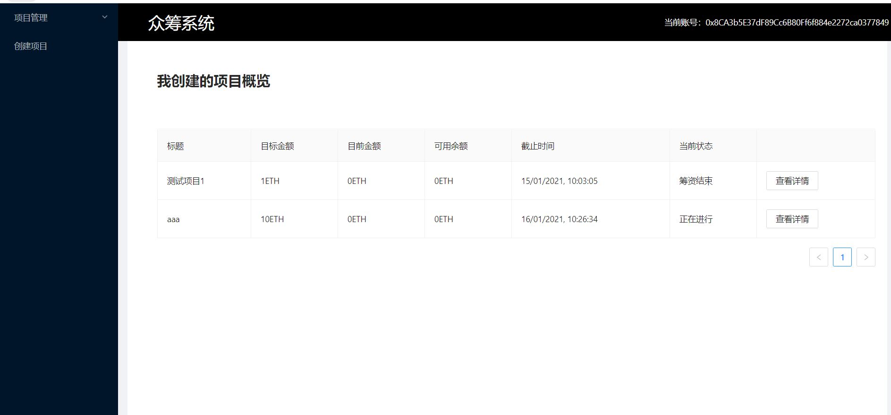

# 众筹项目说明

### 项目采用技术栈

React+Solidity+Node.js

### 项目运行环境

* 用truffle编译智能合约
* 用yarn安装依赖并运行项目（也支持npm）
* 在Ganache 上创建私链
* 需要在Chrome上安装MetaMask插件作为钱包，并导入私链账号

### 运行项目

1. 安装上述项目运行环境

2. 在Ganache中创建私链并且导入项目truffle-config.js，配置默认端口为8545

3. 用truffle编译部署智能合约：truffle compile + truffle migrate

4. 在Ganache中查看合约部署地址，并复制到/src/eth/Crowdfunding.js文件中的第三行

   

5. 接下来安装依赖，可以采用npm或者yarn的方式分别为: npm install/yarn install，建议采用yarn，因为运行速度更快。

6. 运行项目，直接在VScode的npm脚本中选择运行或者在命令行里输入npm start即可。

   

### 项目运行成功后截图

项目概览

项目详细信息即各项操作

