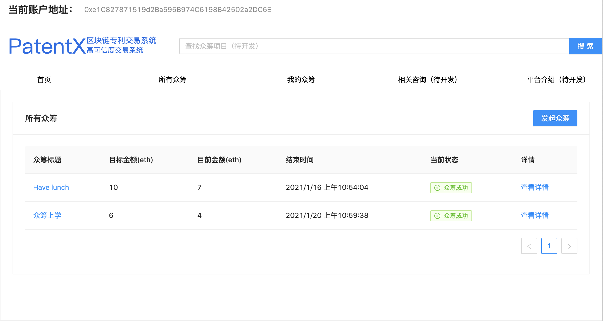
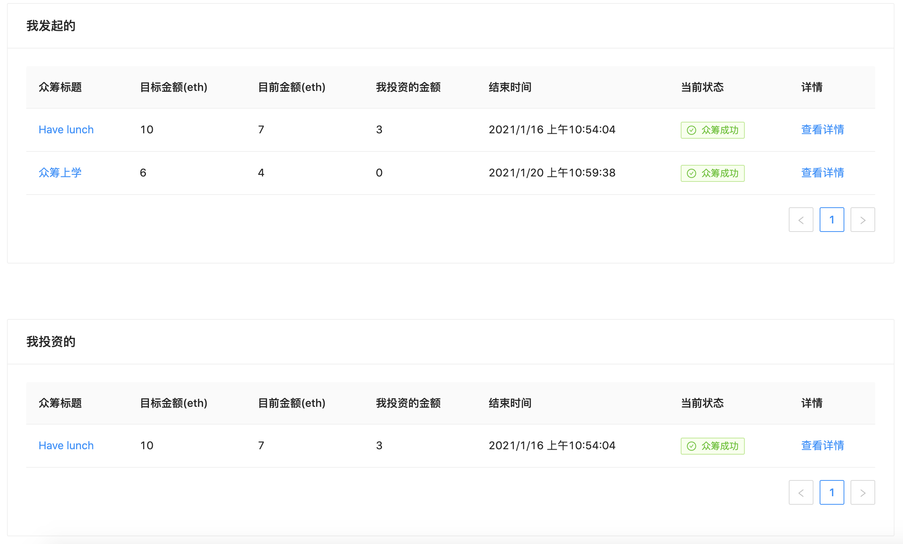
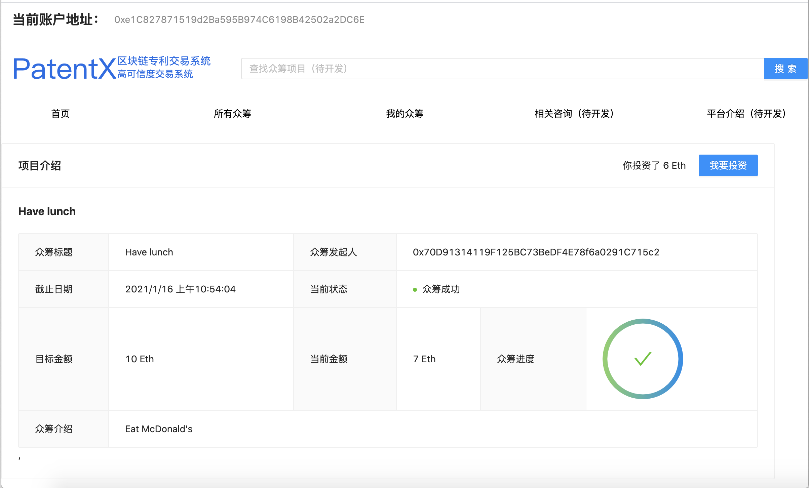
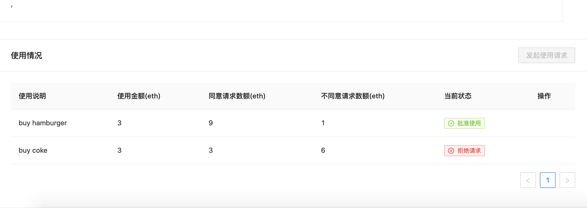

# 如何运行

1. 首先需要配置好`node`、`npm`、`yarn`，安装`ganache`，`chrome`，`chrome`安装插件`MetaMask`
2. 安装 truffle，`yarn global add truffle`
3. 打开`ganache`软件
4. 在`ganache`软件上选择 quickstart，单击右上角齿轮图标进行设置
5. 在 workspace 标签页中 add project 选中 `./truffle-config.js`，server 标签卡将端口改为8545。
6. 单击右上角 save and restart。
7. 打开remix，导入合约（.sol文件）编译，部署
8. 选中 ganache 软件中最上面 TRANSACTIONS 选项卡，找到合约部署的区块，将 crowdFunding 合约的地址复制。将remix中生成的abi复制，在`./crowdfunding/src/api/contract.js`文件中替换掉相应值。
9. 切换到`./client/`目录下
10. 输入：`yarn`
11. 安装完毕后输入：`yarn start`
12. 浏览器中访问：`http://localhost:3000`
13. 在`metamask`中选择连接 localhost:8545 的本地网络，并且从 ganache 中导入几个账户进去，就可以开始测试了。

# 成功界面截图

