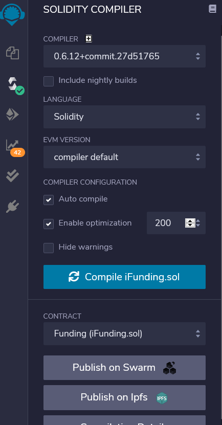

# 众筹Dapp

> 毕予然 3180102070

### 运行

1. 安装Ganache，利用 quick start 创建本地私链，并配置服务器端口。

2. 在浏览器中安装插件MetaMask，并新增网络RPC，即Ganache中RPC server URL。

3. 使用在线Remix IDE编译合约solidity文件，利用SOLIDITY COMPILER 编译文件（选择0.6.12版本），并用Deploy&Run Transactions部署合约到本地私链上，其中环境选择Injected Web3，Account导入Metamask中的进行连接，Contract选择FundingAPI。

   

   

4. 将合约部署生成的地址替换iFunding.js中address。

5. 配置node，npm，输入npm install和npm start运行，并在浏览器local:3000打开。

### 运行截图

1. 可以查看所有项目/发起的项目/投资的项目/未完成的项目。

2. 可以查看项目详细信息，考虑时间设置，标记状态。

   

3. 可以发布众筹项目，包括其截至时间、详细信息等。

4. 可以对众筹项目进行投资。

   

5. 在项目筹资完毕后，项目发起人可以申请资金。

   

6. 投资人可以对投资项目的资金请求以其投资比进行投票。

   

7. 不足50%资金请求投票继续，否则完成。

   

8. 若资金请求通过，发起人账户余额也会变化（如图为投票通过Account5的6ETH资金请求。

   