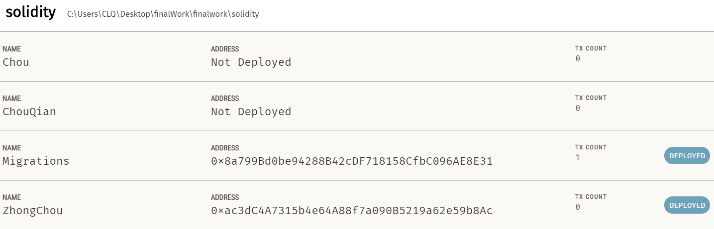

<h1>FinalWork：
   </h1>

<h2>去中心化众筹Dapp</h2>
    <h3>参与方：众筹发起人、投资人</h3>
    <h3需求：</h3>
<h4>
    1. 众筹发起人发起项目众筹，明确项目概述、项目介绍等项目信息，明确众筹金额和截止时间（考虑好时间问题）。
    </h4>
<h4>
    2. 每个用户可以查看所有的众筹项目，也可以查看自己相关的众筹项目（创建者可以查看自己创建的项目、投资人可以查看自己投资过的项目）。</h4>
    <h4>
     3. 投资人可以查看未完成众筹项目，进行投资。
    </h4>
    <h4>
        4. 众筹成功后，众筹发起人一笔资金使用请求，明确使用金额和目的。请求需要经过投资人的投票来决定是否允许使用，满足50%的允许率，可以进行金额的使用。【注意】每位投资人只允许投一票。
    </h4>
    <h4>
        例如：用户A发起了众筹要10ETH，用户B、C进行了项目投资（分别投了8ETH和2ETH）然后众筹成功，即此处B占80%投票权，C占20%投票权。用户A想要用1ETH来采购物资，于是发起金额使用请求。此时如果B同意了请求，即已满足80%的允许率，资金使用请求成功。（金额从合约转入众筹发起人的地址内。）。此时如果仅仅是C同意了请求，即才满足20%的允许率，还需要等待下一位投资人的投票才行。
    </h4>

<h3>
    程礼棋</h3>

<h3>
    3180102634</h3>

# 如何配置环境

技术栈：Node.js+web3+solidity+vscode+react+bootstrap+semantic UI

1. 首先需要配置好`node`、`npm`、`yarn`，安装`ganache`，`chrome`，`chrome`安装插件`MetaMask`

2. 安装 truffle，`yarn global add truffle`

3. 进入/finalwork/solidity目录，输入cmd命令，执行`truffle compile`命令，生成了json文件，在build/contract目录下

4. 打开ganache，新建一个workspace，在Truffle Project中添加/finalwork/solidity/truffle-config.js文件。

   

   

   start开始运行

5. 进入/finalwork/solidity目录，执行`truffle migrate`命令。或者也可以执行`truffle deploy`

6. 部署完成后，在ganache的contracts项中，查看FundingFactory的合约地址。

   

   打开/finalwrok/application/models.js，将第三步得到的合约地址填入到contractAddr中.

   

   

7. 为了方便，可以连接metamask钱包，首相从ganach中导入私钥到metamask，连接网络7545(默认的)，再连接到localhost:2634即可

   

8. 在/finalwokr目录下，运行"npm start"命令。打开浏览器，进入localhost:2634页面。或者在vs code内直接运行就好：

出现此说明运行成功：

# 界面展示：

## 1.登录界面

## 2.主界面

支持FireFox Chrome PC以及手机等

**手机界面如下：**

## 3.众筹信息界面

## 文件架构（基础react架构）

说明：

1. app.js  入口
2. bin/clq server/listenning调用接口
3. route.js  路由
4. views  前端代码
5. solidity/contrat  sol文件  合约
6. application  后端及连接使用的js
7. node_modules内为用到的依赖
8. public 内为前端用到的依赖