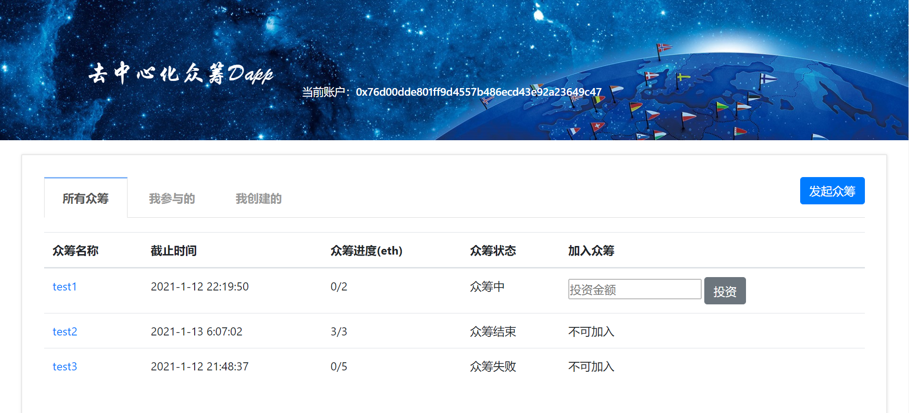
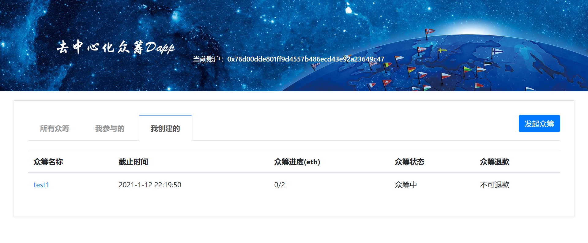
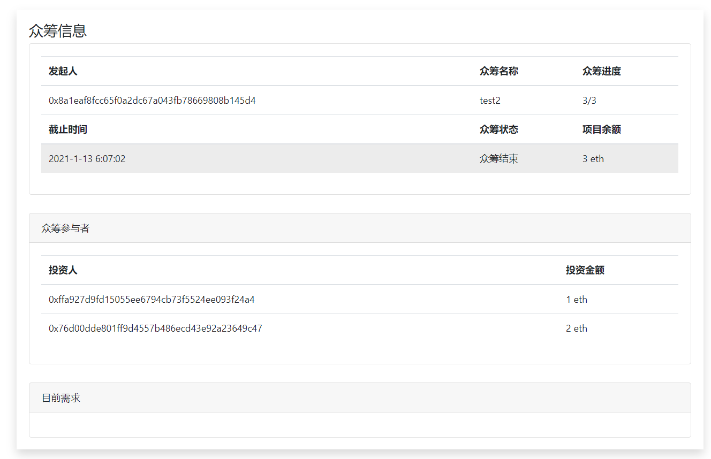

# 去中心化众筹Dapp

<font size="4" color=gray>**3180103733   程梦烨**</font>

## 如何运行

1. 配置 node，npm，yarn，安装 truffle、Ganache、插件MetaMask

2. 打开ganache，新建一个workspace，在truffle Project中添加CrowdFunding/solidity/truffle-config.js文件

3. 删除CrowdFunding/solidity/build中的内容，进入solidity目录，输入命令：

   ```
   truffle compile
   truffle migrate
   ```

4. 在ganache的contracts项中，复制FundingFactory的合约地址，找到CrowdFunding/models/models.js，修改contractAddr的值为复制的地址

5. 在CrowdFunding目录下，输入命令：`npm start`
6. 在浏览器中访问 http://localhost:3000

## 运行截图

1. 所有众筹页面



2. 我的众筹页面



3. 众筹详细信息页面

