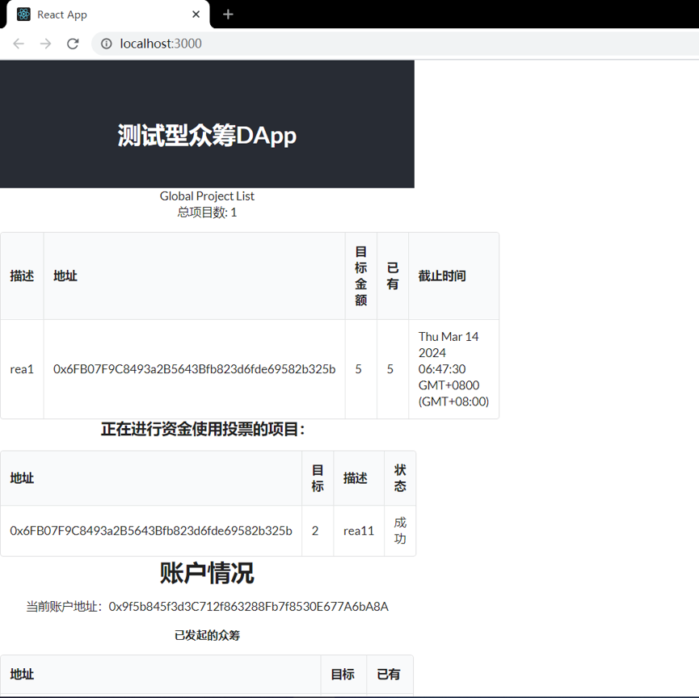
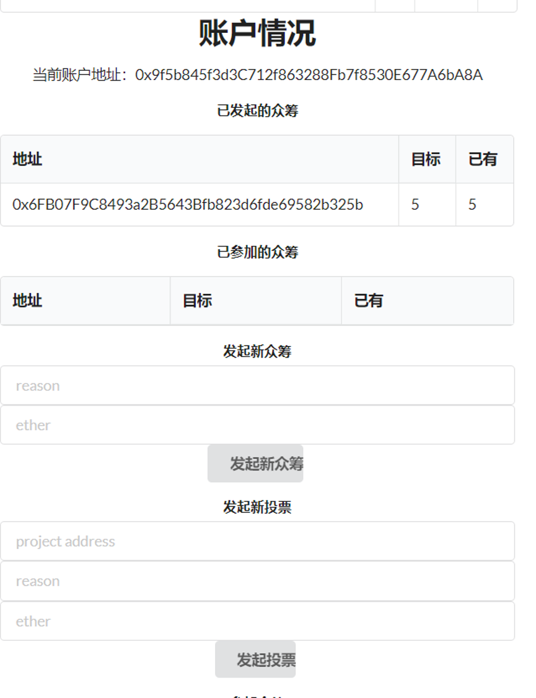
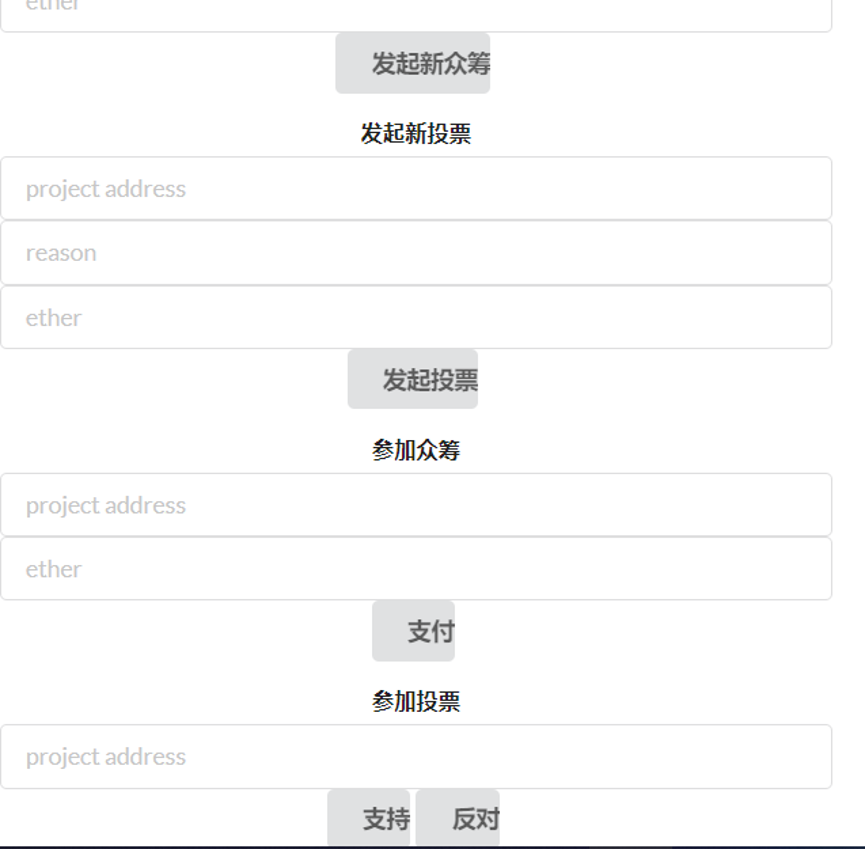

3180105261 游宁远

操作流程见视频

### 文件结构：
workfinal文件夹中存放了项目源代码
其中work文件夹下是React DApp

### 部署：
1.使用ganache建立本地测试网络，导入workfinal文件夹下的`truffle-config.js`
2.编译`mFund.sol`和`Fproject.sol`两个智能合约，并将生成的.json文件复制到./work/src目录下
3.部署mFund合约
4.打开`./work/src`文件夹下的`App.js`，将第7行的mFund_addr变量赋值为mFund的合约地址
5.参照`./work/package.json`的内容，安装必要的web3等node_modules

### 运行：
1.进入`./work文件夹`，通过npm脚本激活React App，通过网页进行交互
2.为避免产生异常，请尽量保持MetaMask只同时连接最多一个账户

### 截图：

