# 众筹合约 康大凯 3180105501

## 如何运行项目

1. 下载Ganache并创建workspace并按下图配置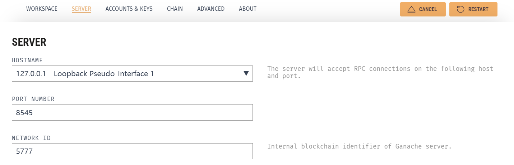

2. 下载并解压源代码，cmd打开，npm install

3. 将contract文件夹下的CrowdFunding.sol文件的内容复制，在remix中编译部署合约到本地（编译器版本选择0.6.12，并勾选Enable optimization，MetaMask连接到本地测试网络）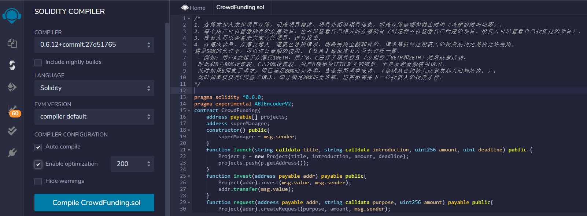

   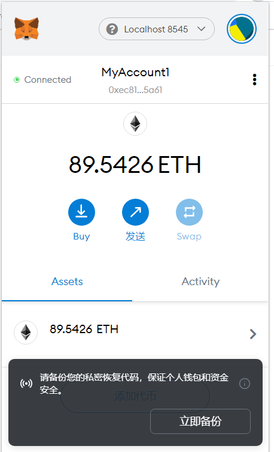

4. 将部署后生成的合约地址，复制到eth文件下的CrowdFunding.js文件中的第542行处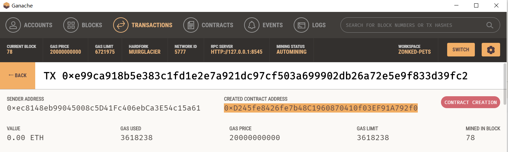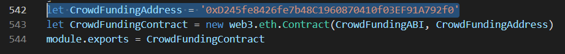

5. 在命令行输入yarn start，若报错则按提示安装相应的包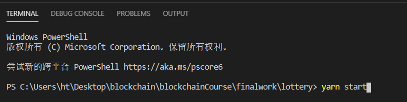

6. 在Chrome浏览器输入 localhost:3000

   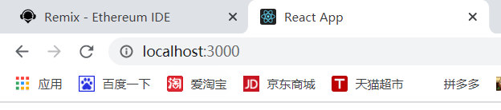

## 系统运行截图

##### 用户A发起众筹

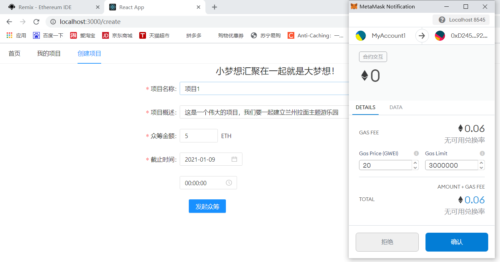

##### 发起的众筹可在首页查看

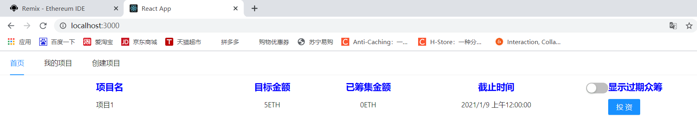

##### 用户A投资给该项目2 ETH

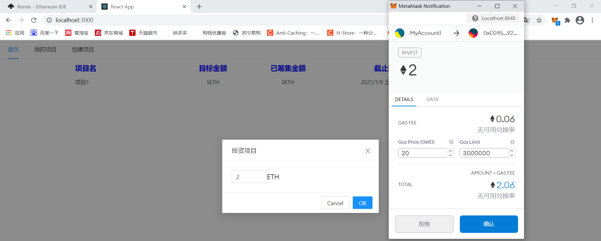

页面刷新，已筹集金额发生变化

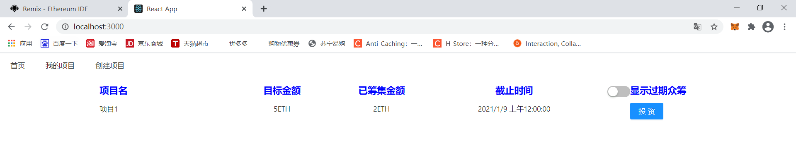

##### 用户B投资给该项目3 ETH后，用户A查看项目详情

项目详情中有投资人及其投资金额的列表，而此时该项目已经集资完毕，投资按钮失效

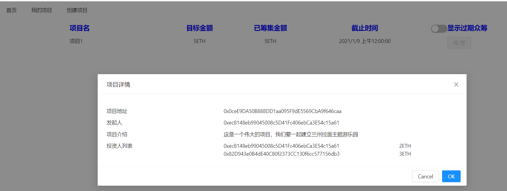

##### 显示过期众筹项目

过期项目无法投资（截图时间为2021/1/8 15:09）

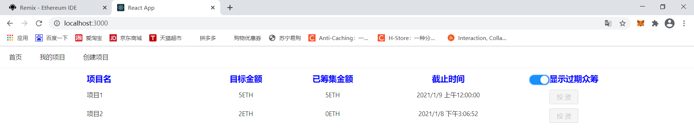

##### 用户A查看自己发起和投资的众筹项目

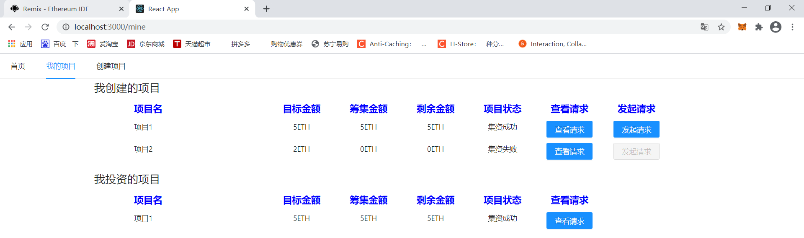

##### 用户A作为项目发起者，对集资成功项目发起一个资金使用请求

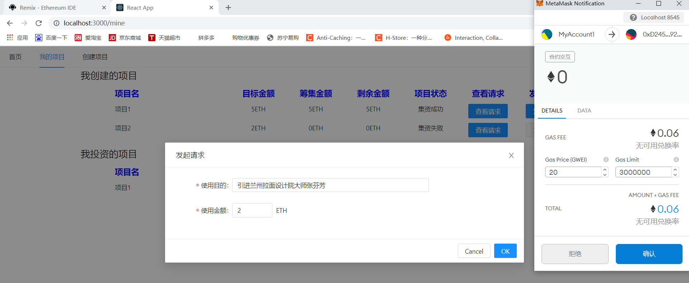

##### 用户A查看自己创建的项目的请求列表

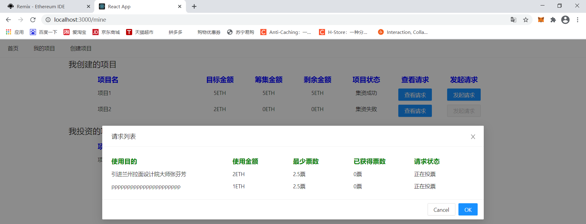

##### 用户A查看自己投资的项目的请求列表

投票按钮处显示投资人所持有的票数，最少票数为请求通过所需要的最少票数。

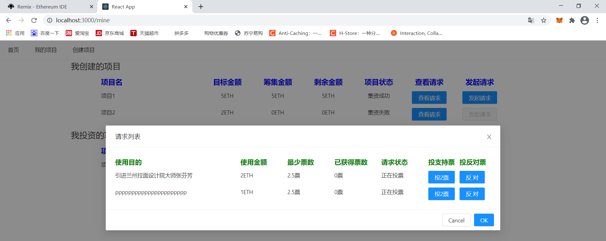

##### 用户A给请求投支持票

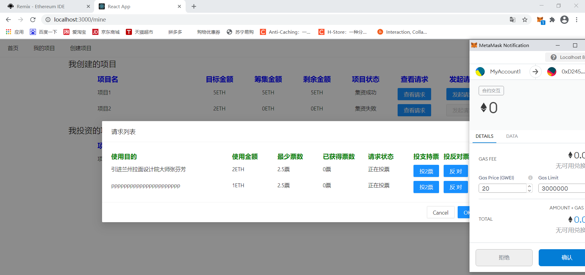

票数刷新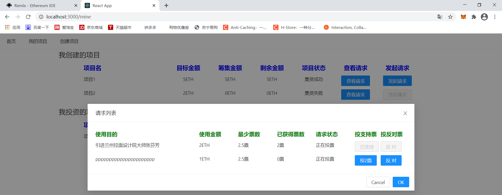

##### 用户B给请求投支持票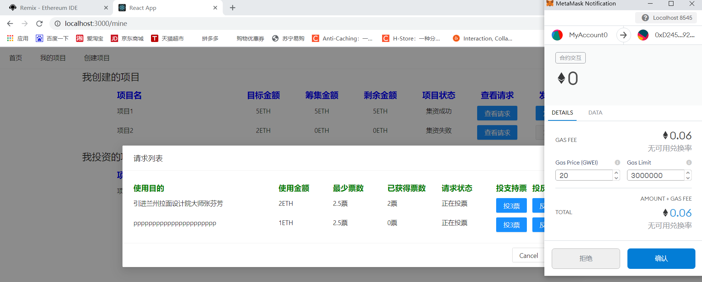

超过最小票数，请求状态更新为已通过

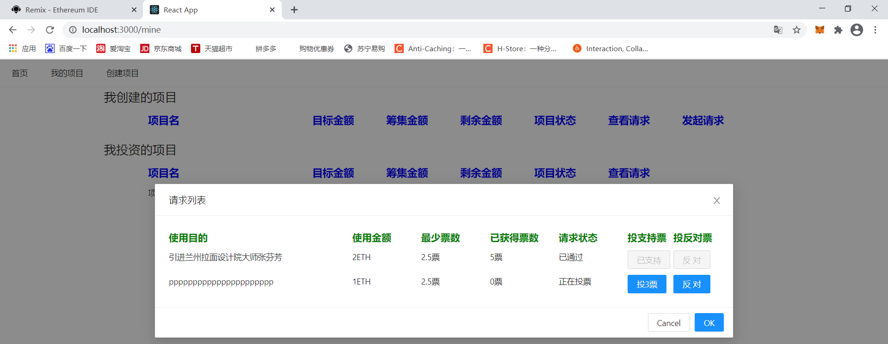

##### 用户B给请求投反对票

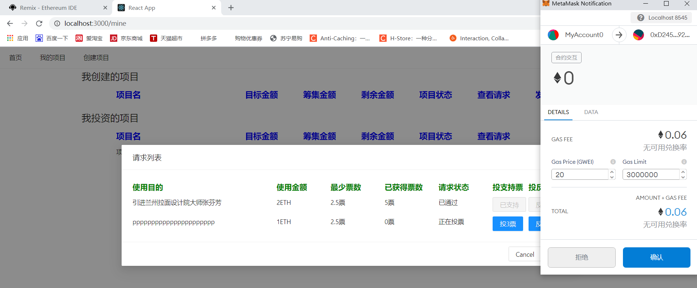

票数已无法达到最少票数，请求状态更新为未通过

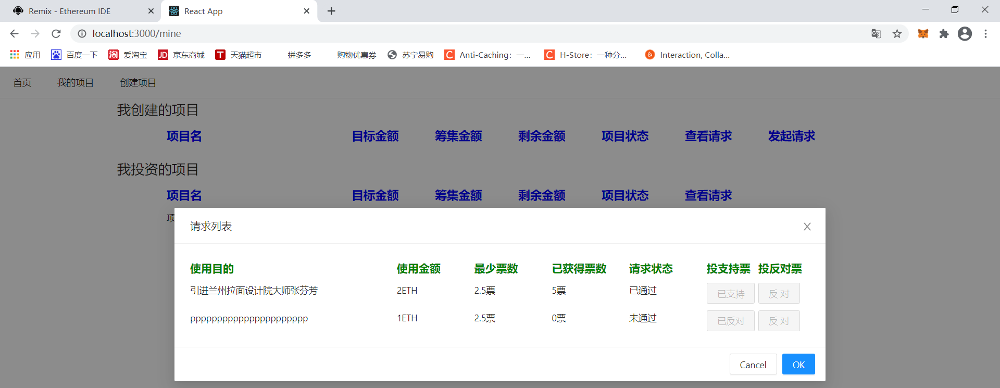