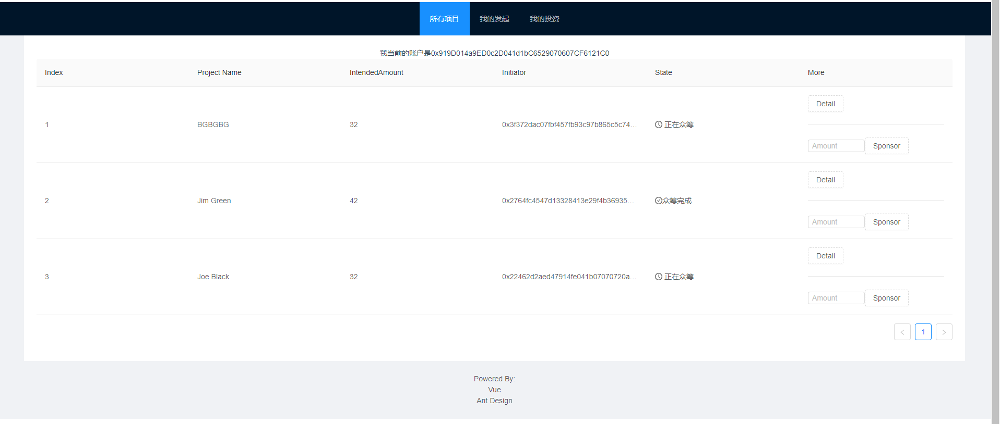
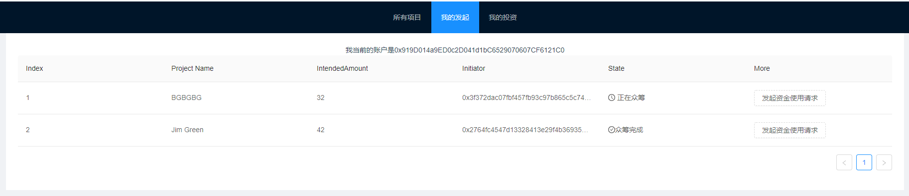
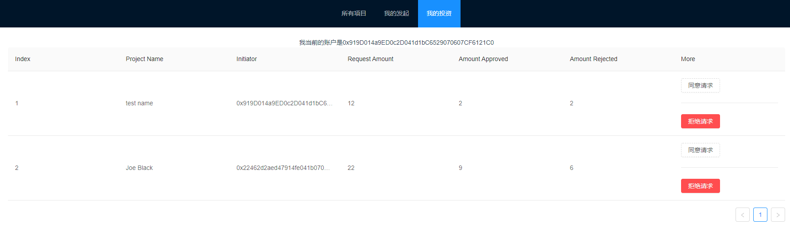

###### Important：

本项目只实现了项目要求的UI框架和solidity合约代码编写测试、前端合约调用代码编写，还未能集成功能，因此不能支持发起项目、赞助项目等一些系列功能。


###### 运行方式：

1. 进入到/mycf目录下，在终端中运行：

   ```shell
   yarn add vue
   yarn add truffle
   yarn add ant-design-vue
   ```

   

2. 在终端中敲入：

   ```shell
   yarn serve
   ```

   

3. 访问localhost:8080


界面截图：








