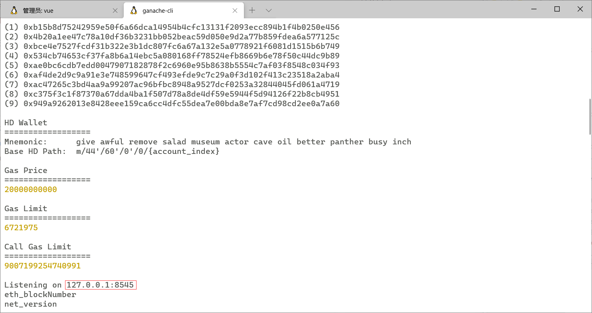

# 项目众筹DApp部署说明

> 郭泽均 3170105271

## 环境说明

本项目在WSL2 Ubuntu20.4 LTS环境下为chrome内核的浏览器开发，如果想要在本地部署本项目，请使用相似环境进行部署。

## 全局依赖项

- truffle
- ganache-cli
- metamask chrome extension
- node
- npm
- vue

## 启动流程

### 本地私有链环境

在本地启动ganache-cli，查看服务启动的端口



### 修改truffle配置文件

修改truffle-config.js中的deployment字段为

```js
development: {
    host: "127.0.0.1",     // Localhost (default: none)
    port: 8545,            // Standard Ethereum port (default: none)
    network_id: "*",       // Any network (default: none)
}
```

### 编译并部署智能合约

- 编译

    `truffle compile`

- 部署

    `truffle migrate`

### 启动程序

```zsh
npm install
npm run serve
```
