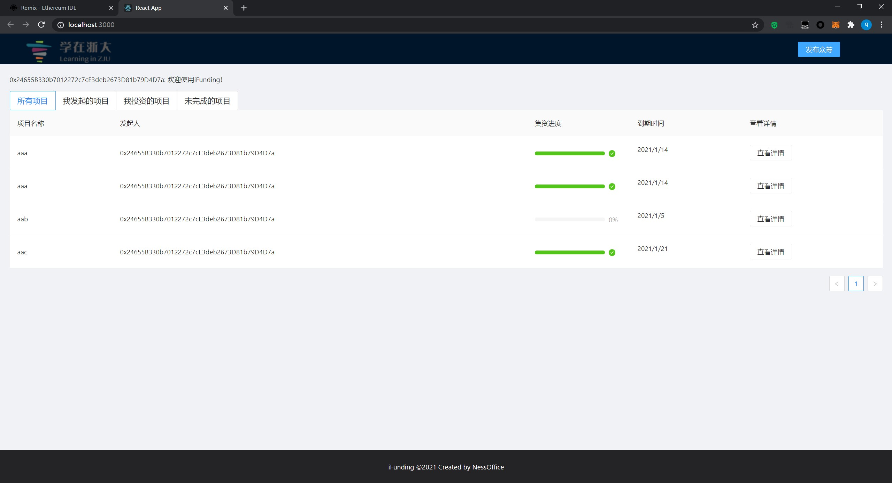
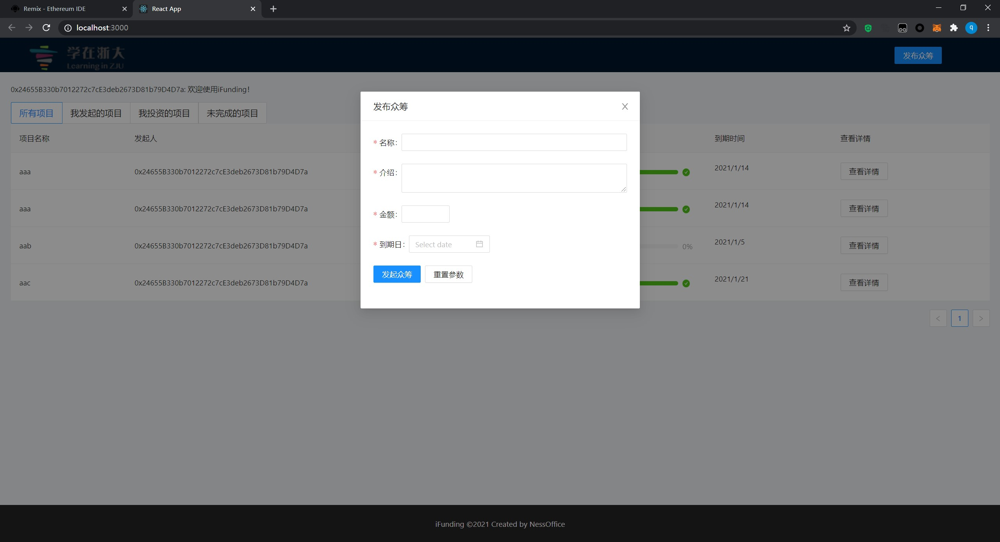
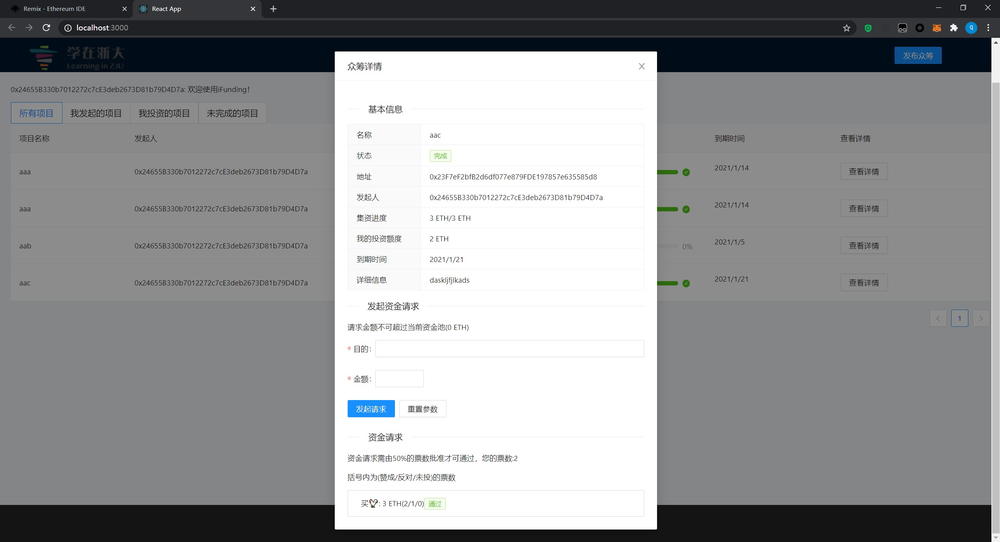

# ❤Funding - DAPP

出于诚信守则，相关设计文档在课程结束前不予公开。

## 运行

未使用工程化的方式部署项目。

1. 用Ganache创建私有网络
2. 编译与部署合约
   1. 在Remix中打开/contracts/iFunding.sol，
   2. 进入SOLIDITY COMPILER页面，选择COMPILER为0.6.12，编译合约
   3. 进入DEPLOY & RUN TRANSACTIONS页面，选择ENVIRONMENT为Injected Web3，CONTRACT选择FundingManager，部署
   4. 将/src/eth/iFunding.js中的address改为部署后的地址
3. 运行项目前端
   1. yarn install
   2. yarn start

## 截图

### 项目主页

### 发布界面

### 合约详情

