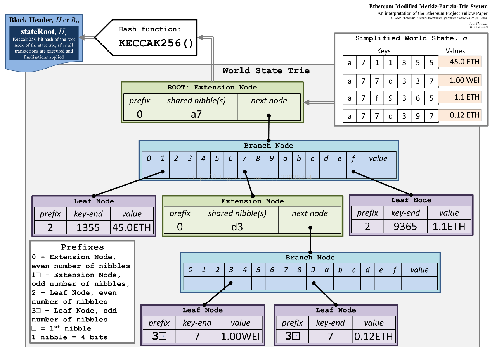

# 作业2：分析MPT源码和作用

**3180106071 刘轩铭**

**目标：分析以太坊源码，说明以太坊中MPT的数据结构，操作流程和作用**

在作业中，我通过在github的ethereum仓库可以下载到以太坊的go源代码，对其进行分析。


## 数据结构

在以太坊源代码中，主要是在包 trie 中实现了MPT。这种数据结构实际上是一种Trie树变种，MPT是以太坊中一种非常重要的数据结构，用来存储用户账户的状态及其变更、交易信息、交易的收据信息。MPT实际上是三种数据结构的组合，分别是Trie树， Patricia Trie， 和Merkle树。

### MPT数据结构

#### 节点

MPT树中的节点包括空节点、叶子节点、扩展节点和分支节点:

- 空节点，简单的表示空，在代码中是一个空串。
- 叶子节点（leaf），表示为[key, value]的一个键值对，其中key是关键字的一种特殊十六进制编码，value是value的RLP编码。在以太坊中用来存储账户的状态。
- 扩展节点（extension），也是[key, value]的一个键值对，但是这里的value是其他节点的hash值，这个hash可以被用来查询数据库中的节点。也就是说通过hash链接到其他节点。
- 分支节点（branch），因为MPT树中的key被编码成一种特殊的16进制的表示，再加上最后的value。前16个元素对应着key中的16个可能的十六进制字符，如果有一个[key,value]对在这个分支节点终止，最后一个元素代表一个值，即分支节点既可以搜索路径的终止也可以是路径的中间节点。




#### Key和Value

从上图看到，Key只在扩展节点和叶子节点中存在，分支节点中没有Key。

Value是用来存储节点数值的，不同的节点类型对应的Value值也会不同，主要如下几种情况：

- 若节点类型是叶子节点，Value值存储的是一个数据项的内容。
- 若节点类型是扩展节点，Value值存储的是孩子节点的哈希值。
- 若节点类型是分支节点，Value值存储的是刚好在分支节点结束时的值，若没有节点在分支节点中结束时，Value值没有存储数据。

作为一种字典树，它是对Key的值进行存储和分支。


### 以太坊代码中的实现（源码分析）

#### node（tries/node.go）

```go
type node interface {
	fstring(string) string
	cache() (hashNode, bool)
	canUnload(cachegen, cachelimit uint16) bool
}

type (
	fullNode struct {
		Children [17]node // Actual trie node data to encode/decode (needs custom encoder)
		flags    nodeFlag
	}
	shortNode struct {
		Key   []byte
		Val   node
		flags nodeFlag
	}
	hashNode  []byte
	valueNode []byte
)
```

在该部分代码中可以看到node分为4种类型，其中：

- fullNode对应了以太坊黄皮书中的分支节点，它有一个容量为17的node数组成员变量Children，数组中前16个空位分别对应16进制(hex)下的0-9以及a-f，这样对于每个子节点，根据其key值16进制形式下的下面第一位的值，就可挂载到Children数组的某个位置，fullNode本身不再需要额外key变量；Children数组的第17位，留给该fullNode的数据部分，也就是可以用来存放在该处结束的节点的Value。
- shortNode对应了黄皮书里面的扩展节点和叶子节点。key是一个任意长度的字符串(字节数组[]byte)，体现了PatriciaTrie的特点，通过合并只有一个子节点的父节点和其子节点来缩短trie的深度。通过对Val的值判断来确定是一个扩展结点还是叶子节点。


#### trie（tries/trie.go）

```go
// Trie is a Merkle Patricia Trie.
// The zero value is an empty trie with no database.
// Use New to create a trie that sits on top of a database.
//
// Trie is not safe for concurrent use.
type Trie struct {
    db           *Database 
    root         node     
	// Keep track of the number leafs which have been inserted since the last
	// hashing operation. This number will not directly map to the number of
	// actually unhashed nodes
	unhashed int
}
```

在该部分代码中可以看出整个Trie的结构：

- root包含了当前的root节点， 
- db是后端的KV存储，trie的结构最终都是需要通过KV的形式存储到数据库里面去，然后启动的时候是需要从数据库里面加载的。


## 操作流程（源码分析）

### 创建

#### New（tries/trie.go）

```go
// New creates a trie with an existing root node from db.
//
// If root is the zero hash or the sha3 hash of an empty string, the
// trie is initially empty and does not require a database. Otherwise,
// New will panic if db is nil and returns a MissingNodeError if root does
// not exist in the database. Accessing the trie loads nodes from db on demand.
func New(root common.Hash, db *Database) (*Trie, error) {
	if db == nil {
		panic("trie.New called without a database")
	}
	trie := &Trie{
		db: db,
	}
	if root != (common.Hash{}) && root != emptyRoot {go
		rootnode, err := trie.resolveHash(root[:], nil)
		if err != nil {
			return nil, err
		}
		trie.root = rootnode
	}
	return trie, nil
}
```

函数接受一个hash值和一个Database参数，如果hieash值不是空值，就说明是从数据库加载一个已经存在的Trie树， 就调用trie.resolveHash方法来加载整颗Trie树。 如果root是空，那么就新建一颗Trie树返回。可以看出，这里主要就是调用了resolveHash方法，来对rootNode进行创建。


### 插入

#### insert（tries/trie.go）

```go
func (t *Trie) insert(n node, prefix, key []byte, value node) (bool, node, error) {
	if len(key) == 0 {
		if v, ok := n.(valueNode); ok {
			return !bytes.Equal(v, value.(valueNode)), value, nil
		}
		return true, value, nil
	}
	switch n := n.(type) {
	case *shortNode:
		matchlen := prefixLen(key, n.Key)
		// If the whole key matches, keep this short node as is
		// and only update the value.
		if matchlen == len(n.Key) {
			dirty, nn, err := t.insert(n.Val, append(prefix, key[:matchlen]...), key[matchlen:], value)
			if !dirty || err != nil {
				return false, n, err
			}
			return true, &shortNode{n.Key, nn, t.newFlag()}, nil
		}
		// Otherwise branch out at the index where they differ.
		branch := &fullNode{flags: t.newFlag()}
		var err error
		_, branch.Children[n.Key[matchlen]], err = t.insert(nil, append(prefix, n.Key[:matchlen+1]...), n.Key[matchlen+1:], n.Val)
		if err != nil {
			return false, nil, err
		}
		_, branch.Children[key[matchlen]], err = t.insert(nil, append(prefix, key[:matchlen+1]...), key[matchlen+1:], value)
		if err != nil {
			return false, nil, err
		}
		// Replace this shortNode with the branch if it occurs at index 0.
		if matchlen == 0 {
			return true, branch, nil
		}
		// Otherwise, replace it with a short node leading up to the branch.
		return true, &shortNode{key[:matchlen], branch, t.newFlag()}, nil

	case *fullNode:
		dirty, nn, err := t.insert(n.Children[key[0]], append(prefix, key[0]), key[1:], value)
		if !dirty || err != nil {
			return false, n, err
		}
		n = n.copy()
		n.flags = t.newFlag()
		n.Children[key[0]] = nn
		return true, n, nil

	case nil:
		return true, &shortNode{key, value, t.newFlag()}, nil

	case hashNode:
		// We've hit a part of the trie that isn't loaded yet. Load
		// the node and insert into it. This leaves all child nodes on
		// the path to the value in the trie.
		rn, err := t.resolveHash(n, prefix)
		if err != nil {
			return false, nil, err
		}
		dirty, nn, err := t.insert(rn, prefix, key, value)
		if !dirty || err != nil {
			return false, rn, err
		}
		return true, nn, nil

	default:
		panic(fmt.Sprintf("%T: invalid node: %v", n, n))
	}
}
```

从上部分代码可以看到，Trie树的插入，这是一个递归调用的方法，从根节点开始，一直往下找，直到找到可以插入的点，进行插入操作。参数node是当前插入的节点， prefix是当前已经处理完的部分key， key是还没有处理的部分key, 完整的key = prefix + key。 value是需要插入的值。 返回值bool是操作是否改变了Trie树(dirty)，node是插入完成后的子树的根节点， error是错误信息。

- 如果当前的节点类型是shortNode(也就是叶子节点)，首先计算公共前缀，如果公共前缀就等于key，那么说明这两个key是一样的，如果value也一样的(dirty == false)，那么返回错误。 如果没有错误就更新shortNode的值然后返回。如果公共前缀不完全匹配，那么就需要把公共前缀提取出来形成一个独立的节点(扩展节点), 扩展节点后面连接一个branch节点，branch节点后面看情况连接两个short节点。首先构建一个branch节点(branch := &fullNode{flags: t.newFlag()}),然后再branch节点的Children位置调用t.insert插入剩下的两个short节点。这里有个小细节，key的编码是HEX encoding,而且末尾带了一个终结符。考虑我们的根节点的key是abc0x16，我们插入的节点的key是ab0x16。下面的branch.Children[key[matchlen]]才可以正常运行，0x16刚好指向了branch节点的第17个孩子。如果匹配的长度是0，那么直接返回这个branch节点，否则返回shortNode节点作为前缀节点。
- 如果当前的节点是fullNode(也就是branch节点)，那么直接往对应的孩子节点调用insert方法
- 如果当前节点是hashNode, hashNode的意思是当前节点还没有加载到内存里面来，还是存放在数据库里面，那么首先调用 t.resolveHash(n, prefix)来加载到内存，然后对加载出来的节点调用insert方法来进行插入。


### 查找

#### tryGet（tries/trie.go）

```go
func (t *Trie) tryGet(origNode node, key []byte, pos int) (value []byte, newnode node, didResolve bool, err error) {
	switch n := (origNode).(type) {
	case nil:
		return nil, nil, false, nil
	case valueNode:
		return n, n, false, nil
	case *shortNode:
		if len(key)-pos < len(n.Key) || !bytes.Equal(n.Key, key[pos:pos+len(n.Key)]) {
			// key not found in trie
			return nil, n, false, nil
		}
		value, newnode, didResolve, err = t.tryGet(n.Val, key, pos+len(n.Key))
		if err == nil && didResolve {
			n = n.copy()
			n.Val = newnode
		}
		return value, n, didResolve, err
	case *fullNode:
		value, newnode, didResolve, err = t.tryGet(n.Children[key[pos]], key, pos+1)
		if err == nil && didResolve {
			n = n.copy()
			n.Children[key[pos]] = newnode
		}
		return value, n, didResolve, err
	case hashNode:
		child, err := t.resolveHash(n, key[:pos])
		if err != nil {
			return nil, n, true, err
		}
		value, newnode, _, err := t.tryGet(child, key, pos)
		return value, newnode, true, err
	default:
		panic(fmt.Sprintf("%T: invalid node: %v", origNode, origNode))
	}
}
```

在源码中，获取key的流程，其实首先是通过Get函数和TryGet函数进入，然后调用上面的tryGet函数完成的。

其核心逻辑在于递归调用tryGet函数，类似于我们一般对于树的搜索方法。就是很简单的遍历Trie树，来获取Key的信息。在代码中，依次判断该节点的类型：

- 如果是分支节点，就会按照字典树的方式，去查找下一位（pos+1）对应的路径
- 如果是叶子节点，内容匹配，返回查找结果；内容不匹配，返回错误信息
- 如果是扩展结点，继续对关联的分支节点进行查找
- 如果是hashNode, 先加载内存，然后进行查找


### 删除

#### delete（tries/trie.go）

该部分操作类似于插入操作，这里就不赘述了。


## 作用

### 使用的区域

MPT树是每个区块区块头中的成员。并且，以太坊的每一个区块头，并非只包含一棵 MPT 树，而是包含了三棵 MPT 树，分别对应了四种对象：

- **State Trie 区块头中的状态树**
  - key => sha3(以太坊账户地址address)
  - value => rlp(账号内容信息account)

- **Transactions Trie 区块头中的交易树**
  - key => rlp(交易的偏移量 transaction index)
  - 每个块都有各自的交易树，且不可更改

- **Receipts Trie 区块头中的收据树**
  - key = rlp(交易的偏移量 transaction index)	
  - 每个块都有各自的交易树，且不可更改

- **Storage Trie 存储树**
  - 存储智能合约状态


### 主要作用

MPT树具有三种树各自的作用和优点：

#### 提供存储任意长度的key-value键值对数据方法

这是Trie树本身决定的


#### 提供了一种快速计算和数据校验的机制

Trie树的节点关系，一般是使用比如C语言的32位或64位的内存地址指针来串联起来的。但在以太坊中为了实现数据的防篡改及校验，我们引入了`Merkle Tree`，使用节点的哈希值来建立节点关系。这样，如果一个给定的前缀的根哈希值是已知的，那么任何人都可以根据这个前缀来检查。对于一个攻击者，不可能能证明一个不存在键值对存在，因为根哈希最终依赖所有的下面的哈希值，所以任何的修改都会导致根哈希值的改变。此外，还可以进行快速的证明，对某节点的存在性进行验证。


#### 提供了高效的查找方法

Trie树的一个主要的缺陷是低效。即使你只想存一个键值对，但其中的键长度有几百字符长，那么每个字符的那个层级你都需要大量的额外空间。每次查找和删除都会有上百个步骤。在这里我们引入`Patricia`树来解决这个问题。

