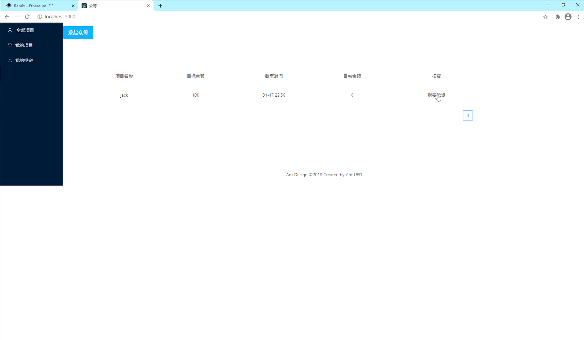
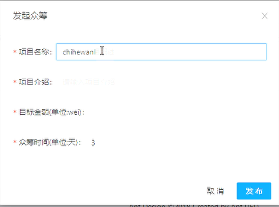
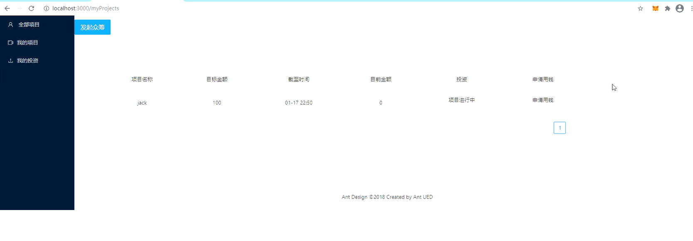

## README

1. **运行**
   - 将目录下的CrowdFund.sol与Project.sol文件上传至Remix，进行编译
   - 打开Ganache，使用默认的8545端口
   - 在Remix官网上选择Web3Provider进行部署
   - 将生成的Adress复制后替换config.js中的CROWDFUNDINHG_ADDRESS变量
   - 在本地目录下使用npm install安装必要文件
   - 在本地目录下使用npm start命令运行

2. **项目截图**

**主页面**

发起众筹

我的项目

我的投资

