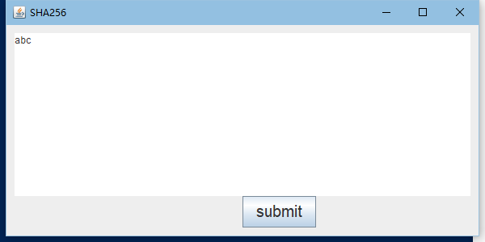
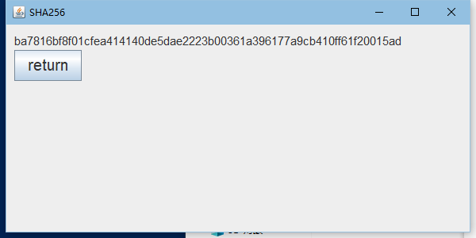
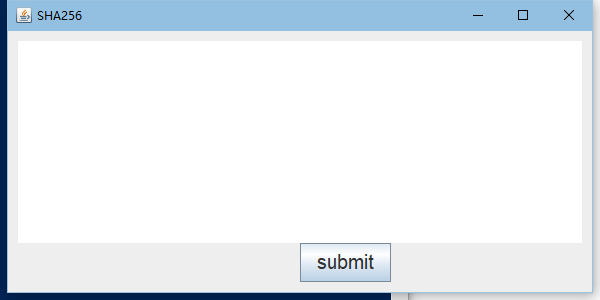
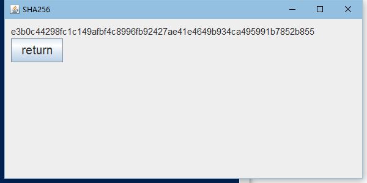
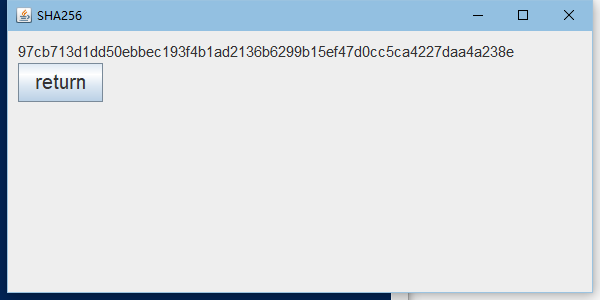
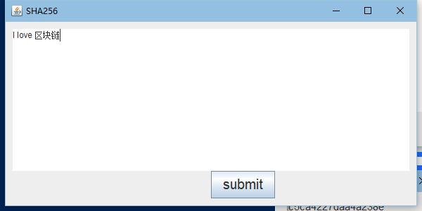
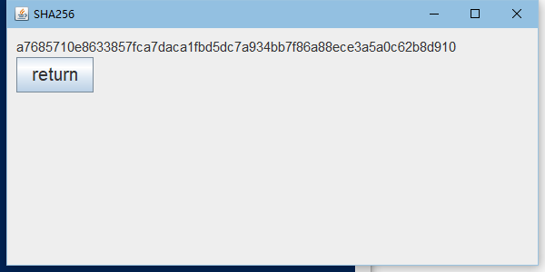
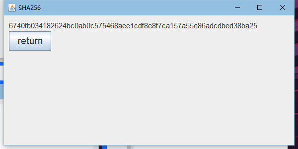

## README

编译方法：

确保javac环境已安装（学生本人环境为javac 14.0.2）

进入到SHA256.java文件所在目录下

输入：

```
javac -encoding utf-8 .\SHA256.java
```

进行编译，若无报错且目录下生成SHA256.class、SHA256$1.class、SHA256$2.class则成功

再次在目录下输入

```
java SHA256
```

即可运行



输入要加密的数据后点击submit，即可显示结果



- 输入空字符串





- 输入带会车的数据




- 输入中文





- 输入长度超过512bit的数据


