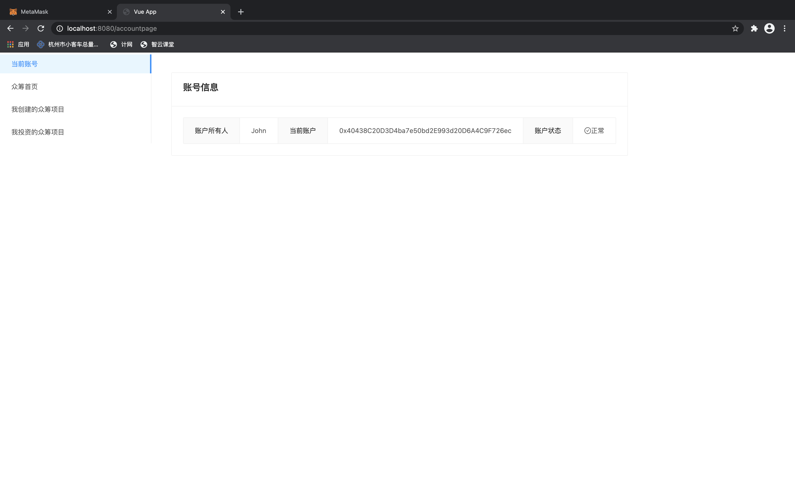
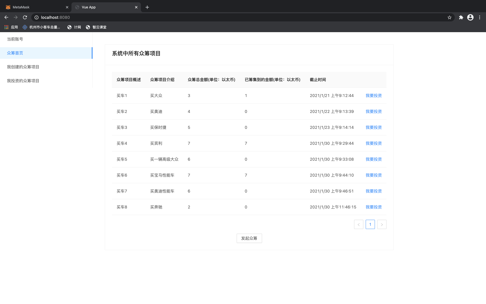
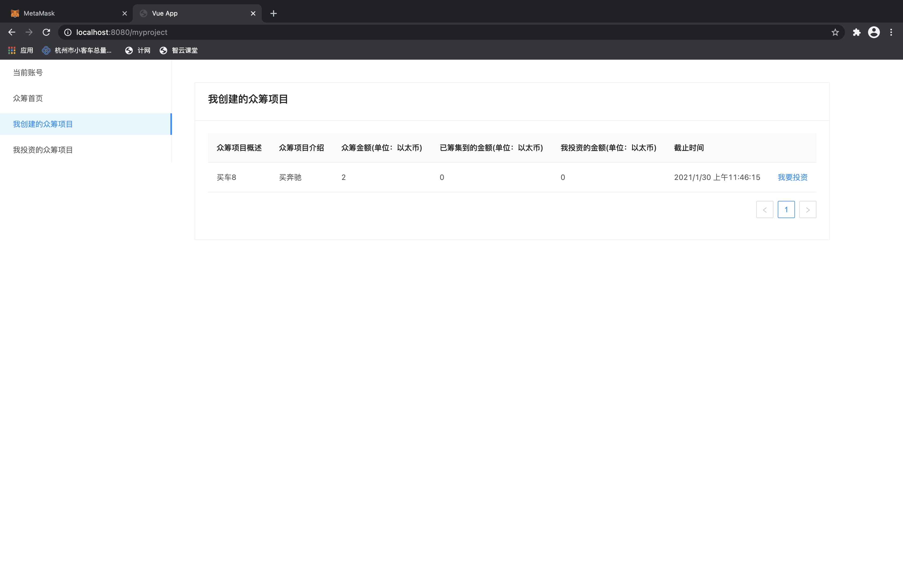
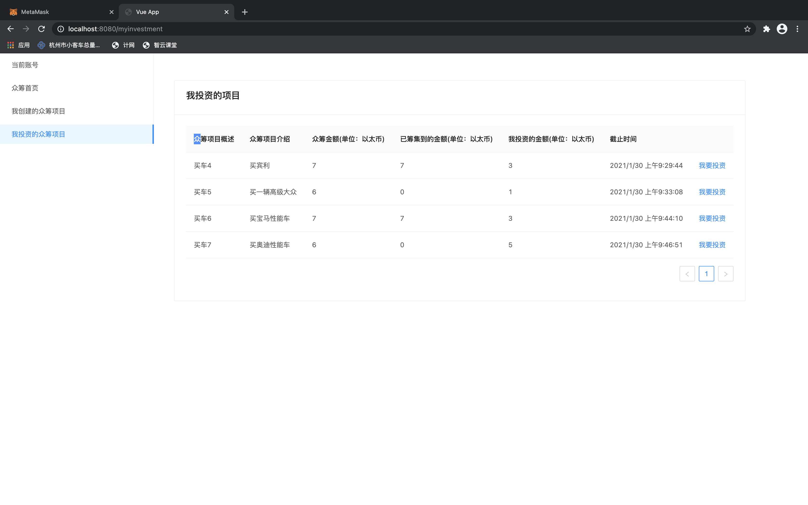
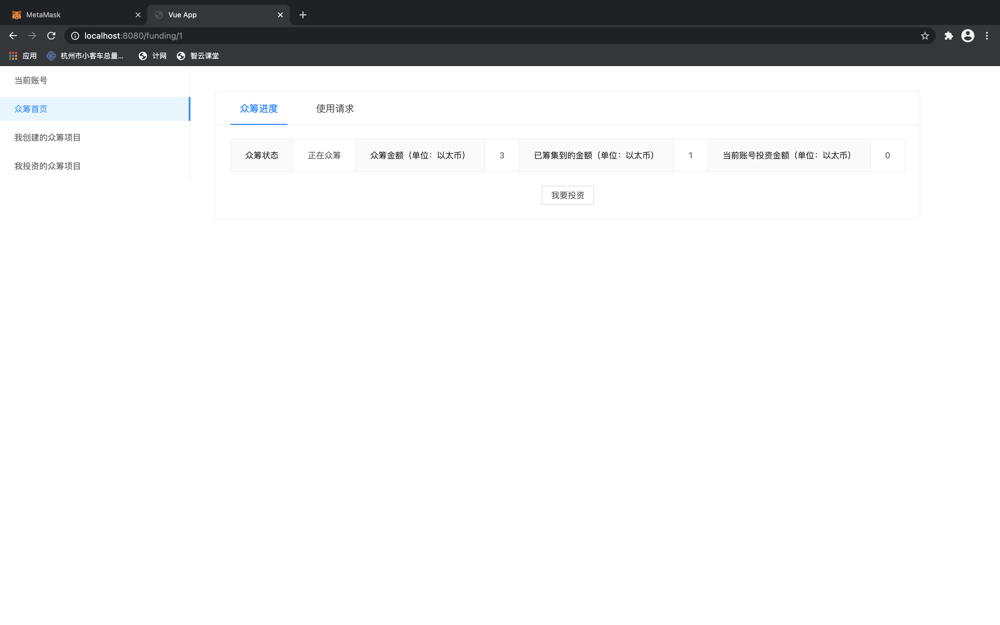
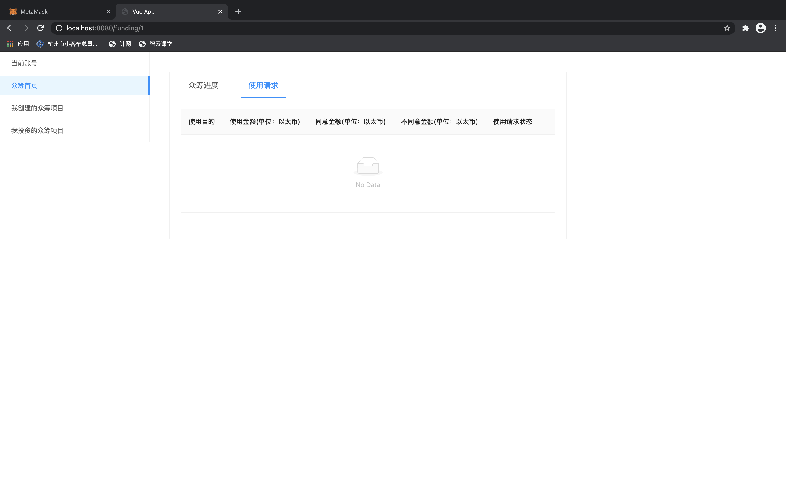

#### 1. 如何运行项目

- 安装ganache软件，进入设置页面，用final目录下的truffle-config.js文件配置ganache，并且将端口号设置为8545。
- 浏览器安装MetaMask插件，并注册账号。网络选择localhost:8545。复制账号地址到final/src/contract.ts相应位置。
- 回到final目录执行命令“truffle compile”和“truffle migrate”。
- 在ganache软件的contracts栏中复制CrowdFunding的地址到final/src/contract.ts相应位置。
- 在ganache软件的Accounts栏中复制私钥，向MetaMask钱包插件中导入3个账号。
- 重新回到final目录执行命令“truffle compile”和“truffle migrate”。
- 将final/build/contracts下的CrowdFunding.json文件复制到final/src目录下，进行替换。
- 回到final目录输入命令安装相关模块：“yarn add @material-ui/core”
- 输入命令编译运行：“yarn serve”
- 在浏览器上通过http://localhost:8080访问网页

#### 2. 项目运行成功后的界面截图

账号信息界面：

系统所有众筹界面：

我创建的众筹项目界面：

我投资的众筹项目界面：

投资众筹界面：

使用请求界面：

