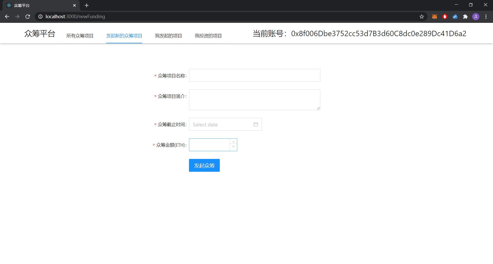
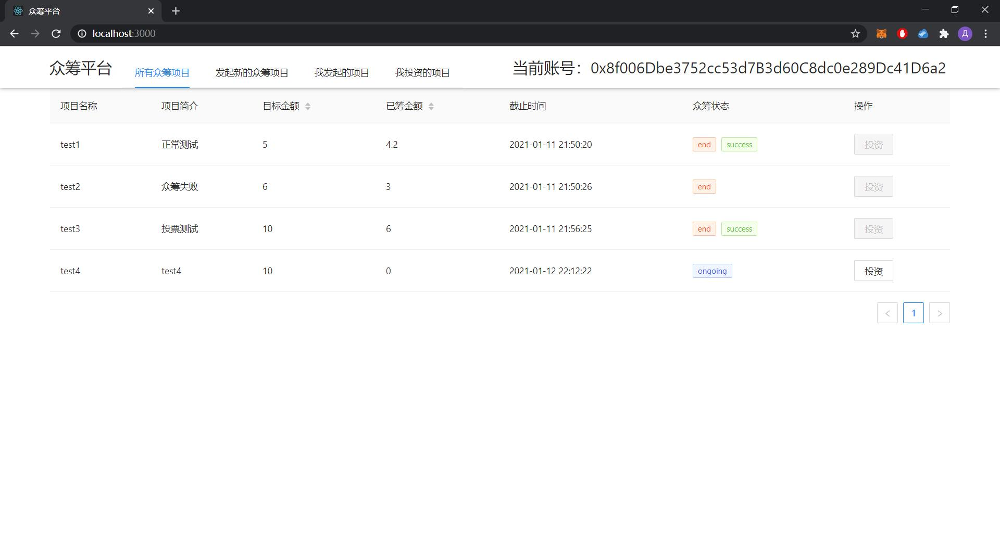
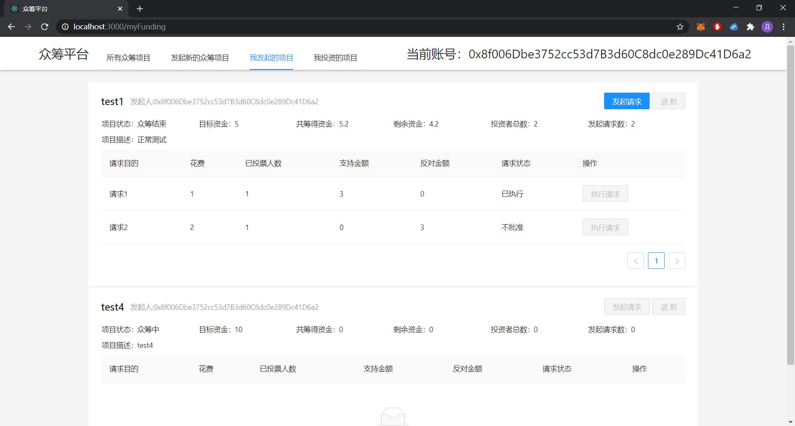
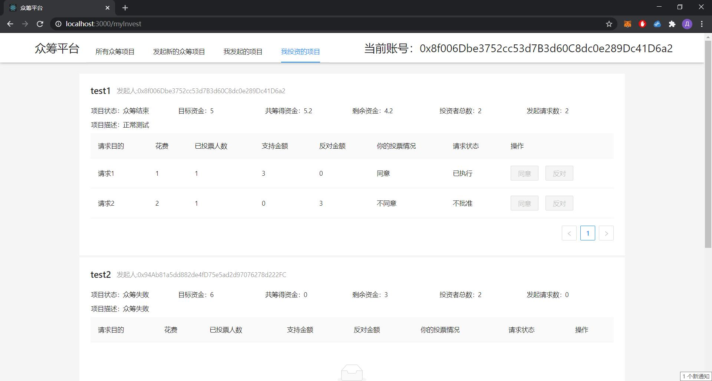

# 浙江大学 区块链与数字货币课程
姓名：王晨露

学号：3180103485

## 编译环境
- 操作系统：Windows 10
- IDE: VS Code
- 浏览器：87.0.4280.141（正式版本）（64 位）
- npm 6.14.8
- node v10.16.0
- yarn 1.22.4
- Truffle v5.1.60

## 如何运行
1. 配置 node，npm，yarn，安装 truffle，安装 Ganache，Google Chrome浏览器，安装插件MetaMask

2. 打开 Ganache，选择 quickstart，单击右上角齿轮图标，
在 workspace 标签页中 add project 选中 ./truffle-config.js，server 标签卡将端口改为8545

3. 配置完毕后，单击右上角 save and restart
4. 在 finalWork 文件夹下，依次输入命令：
```
truffle develop
compile
migrate
```

5. 选中 Ganache 软件中最上面 contracts 选项卡，将 Crowdfunding 合约的地址复制，找到client\src\eth\fundingFactory.jsx，将第7行 address 变量的值设为刚刚复制的地址

6. 进入到client目录，输入命令
```
npm install
npm start
```
然后浏览器中访问：http://localhost:3000

7. 在metamask中选择连接 localhost:8545 的本地网络，并且从Ganache 中导入几个账户进去，将账户与 http://localhost:3000 网页进行连接


## 运行截图

1. 发布新的众筹项目



2. 所有众筹项目列表



3. 查看自己创建的项目



4. 查看自己投资的项目

