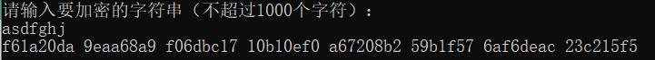
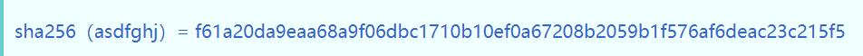
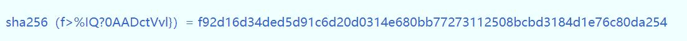

# 作业1
## 作业内容
- SHA256实现
- 设计实验说明SHA256如何用于区块数据锁定
- 设计实验说明SHA256在PoW中的作用

## 实验环境
- 开发语言：C++
- 开发环境：Visio Studio 2017
- 运行环境：Windows 10

## 实验测试  
1. 输入: asdfghj  

  

2. 输入: f>%IQ?0AADctVvl}  

## 代码运行
1. 源代码存放在 /SHA256_vs2017/code 目录下  

2. 打开SHA256_vs2017目录下的SHA256.sln，即可编译运行  

3. SHA256.exe是可执行程序  

4. 程序运行后可以有两种模式可选择，一种是对输入的字符串进行SHA256加密，另一种是PoW算法的测试，程序会在输入的字符串后加上数字，生成1000个输入字符串，对每个字符串进行PoW运算，输出output.txt。
