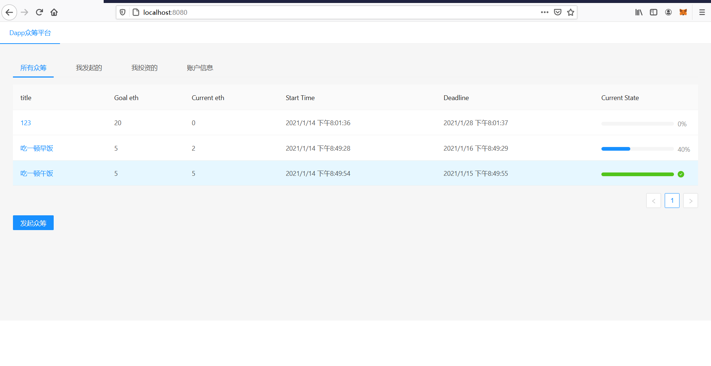

## 运行方式：

1. 安装相关依赖 
2. 打开ganache,导入./truffle-config.JS
3. 主目录下运行truffle migrate 部署合约
4. 复制CrowdFunding地址到./client/src/api.ts第十三行add变量
5. cd ./client 
6. 输入命令npm run serve 
7. 浏览器进入localhost:8080 
8. 导入账户到metamask，连接到localhost:8545端口
9. 开始使用

## 运行截图：

其余界面见视频，只有主页有一些更新