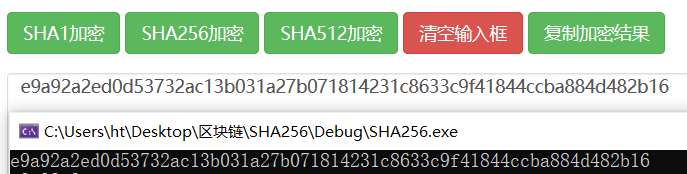
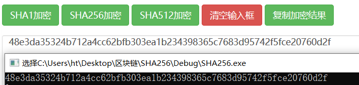
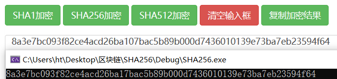

# SHA256

康大凯   3180105501

语言：C++

IDE：Visual Studio 2019

### SHA256算法的实现

​		哈希函数，又称散列算法，是一种从任何一种数据中创建小的数字“指纹”的方法。散列函数把消息或数据压缩成摘要，使得数据量变小，将数据的格式固定下来。该函数将数据打乱混合，重新创建一个叫做散列值（或哈希值）的指纹。散列值通常用一个短的随机字母和数字组成的字符串来代表。对于任意长度的消息，SHA256都会产生一个256bit长的哈希值，称作消息摘要。

​		SHA256算法的原理和伪代码在网络上都有详尽的资料，在此不再赘述。

​		我准备了3个字符串A,B,C分别为：

​		A = ABCDEFG

​		B = ABEjafnln8owh3oGuGGgi7g68gigwohFG

​		C = jafnln8ooGUKBukeknwanto8q24n0npqmnganpbmanib8h8h3nr13lr1bbbnlainfbukG7OIGOgi7g68gtigfrnwohFG

​		以下是我的算法得到的结果和在线验证平台得到的结果对比截图

​		A：	

​		

  		B：

​		

​		C：

​		

​		由对比结果可知，我的算法实现是正确的。

### SHA256在区块链中的应用

#### 简单的支付验证

​		Merkle树大多用来进行完整性验证，比如分布式环境下，从多台主机获取数据，怎么验证获取的数据是否正确呢，只要验证Merkle树根哈希一致，即可。

​		假定当前区块中有4个交易，分别为

​		A = ABCDEFG

​		B = ABEjafnln8owh3oGuGGgi7g68gigwohFG

​		C = jafnln8ooGUKBukeknwanto8q24n0npqmnganpbmanib8h8h3nr13lr1bbbnlainfbukG7OIGOgi7g68gtigfrnwohFG

​		D = 123456789QWERTYUIOP

​		令H(x)=SHA256(SHA256(x))。根据Merkle树的构建图示可逐层构建出Merkle树。

​		HA = c2008ddf172e836da2551f016d9e5cd32db0fb4c38c156215d2bb03ee7dfa93a
​		HB = 9796ba123878e5b4c00b70c50398f7bb7c3928e690d09e572da9dbae665d8e3
​		HC = 38347b7bf66db4f4bc808a507cf1bce1c5f49040ac9d465dce48340eeac2ee05
​		HD = b775aa5b20c6458f954dd5efdb52a395f85e340ed100f64641ad173da0d63913
​		HAB = fcec8f5ba17436e8720f0b468918792bf4774327228a855e1fded81ce8360b2a
​		HCD = dc1b7ac824156e61451df6512e83e097617e1be88dbebedff0b537e9ea2656a8
​		HABCD = 1577df8edfba4b64971969a911d273085fe6144c7b83edbec98e191c3bfdbea

##### 快速比较大量数据

​		比较根节点即HABCD是否与其他节点的根节点相同即可确认数据是否完全相同，如下文“快速定位修改”中HABCD != HABCD'，可知他们代表的数据不全相同。

​		当改变D为123456789QWERTYUIO （少了一个字符P），Merkle树为:

​		HA = c2008ddf172e836da2551f016d9e5cd32db0fb4c38c156215d2bb03ee7dfa93a
​		HB = 9796ba123878e5b4c00b70c50398f7bb7c3928e690d09e572da9dbae665d8e3
​		HC = 38347b7bf66db4f4bc808a507cf1bce1c5f49040ac9d465dce48340eeac2ee05
​		HD = 7949954cd2aaebe8d91f37ded41ca79dc15a5a71fa0bc7cb1551f9b06ce59a21
​		HAB = fcec8f5ba17436e8720f0b468918792bf4774327228a855e1fded81ce8360b2a
​		HCD = 734eb64748150293b0535a785dbbe076f3511294e8c34c7773ef159583294bc
​		HABCD = 930af6ca4721eb2c37afad08a0494e2fe8adaaff77cc48fef60575692c1f92bd

​		无需比较其余节点，仅通过HABCD即可发现数据不完全相同。

##### 快速定位修改

​		如上文提及，当D改变，我们可以通过将不同的节点作为一条路径，ABCD->CD->D，而快速定位被修改的交易。

##### 快速验证数据

​		假设要验证D是否在Merkle树中，只要提供路径D->CD->ABCD上邻居节点的哈希值（HD, HAB）及根节点哈希（HABCD）即可验证。

#### 工作量证明

​		从去中心化账本的角度来看，每个加入到比特币网络节点都要保存一份完整的账本。如果每个节点不能同时记账，处于不同网络，接收不同节点信息，难以保证获得最新账本信息。如果每个节点同时记账的话，必然会导致账本的不一致，造成账本混乱。

​		比特币区块链通过**竞争记账**方式解决去中心化的账本一致性问题。竞争记账是过程，而不证明竞争结果。采用工作量证明（Proof of Work，PoW）的机制来实现竞争结果判定。

​		以下是对于上述字符串A,B,C,D，找到前n比特为0的哈希值需要的次数的表格。

字符串A = ABCDEFG

| 为0比特数 | 哈希次数 |
| --------- | -------- |
| 4         | 8        |
| 8         | 9        |
| 12        | 3543     |
| 16        | 37217    |

字符串B = ABEjafnln8owh3oGuGGgi7g68gigwohFG

| 为0比特数 | 哈希次数 |
| --------- | -------- |
| 1         | 6        |
| 2         | 262      |
| 3         | 2219     |
| 4         | 2219     |

字符串C = jafnln8ooGUKBukeknwanto8q24n0npqmnganpbmanib8h8h3nr13lr1bbbnlainfbukG7OIGOgi7g68gtigfrnwohFG

| 为0比特数 | 哈希次数 |
| --------- | -------- |
| 1         | 5        |
| 2         | 1120     |
| 3         | 6256     |
| 4         | 20128    |

字符串D = 123456789QWERTYUIOP

| 为0比特数 | 哈希次数 |
| --------- | -------- |
| 1         | 19       |
| 2         | 148      |
| 3         | 1126     |
| 4         | 9080     |

​		根据结果分析，需要的哈希次数根据为0比特数而指数增长，忽略掉数据的特殊性，找到一个前n比特为0的哈希值需要计算2^n次。这个n即难度系数，比特币的方案中设定合适的n使得大致每十分钟有一个新的区块诞生（即每十分钟一次记账）。

### 心得体会

​		第一次自己实现哈希算法，发现其并没有想象中那么困难，写出来也比较有成就感。在编程过程中发了一些内存管理的错误，经过不断调试最终得到了正确结果，也提高了自己的编程能力。