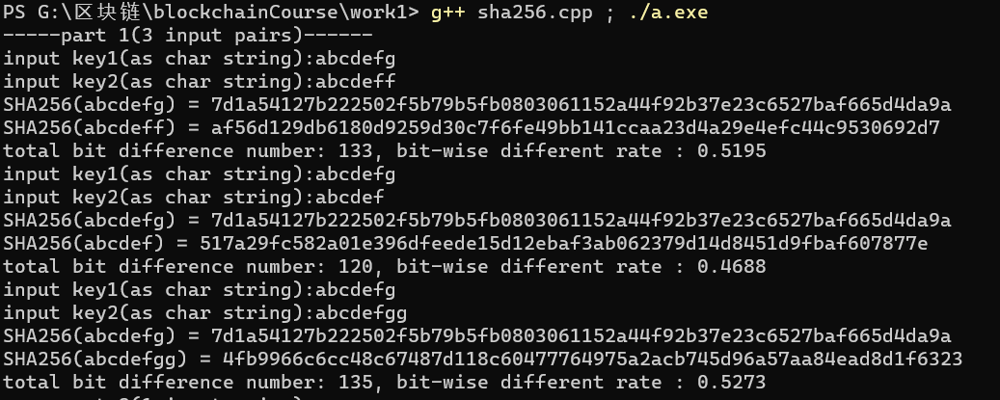
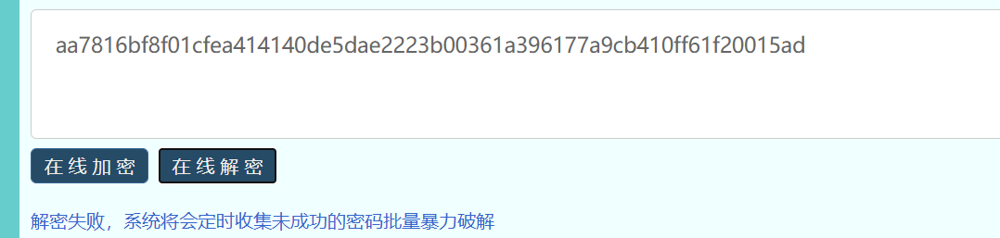
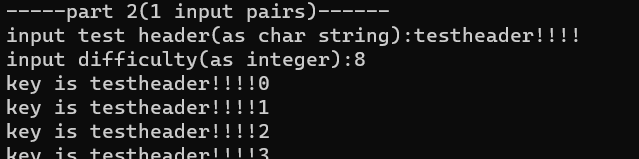

## 算法实现

算法具体实现见sha256.cpp。

## 简单实验

### 实验1：安全哈希算法锁定区块的作用

首先考察SHA256算法的安全特性，输入测试如下：

          

我们知道，ASCII码中相邻间隔的字母都是仅仅相差1，并且‘f’和‘g’是仅仅有1位之差，但是从测试结果来看，改变1位的值，哈希结果却有133bit的差距，而这样的差距恰恰和两个256bit的随机数的比特差别率几乎相同。之后的两组，增加一个byte和减少一个byte也得到了类似的结果。这样的结果说明，对SHA256算法，仅仅只是微小的输入差别，产生的结果却是几乎不相关的平均数。

另外，SHA256也实现了哈希碰撞的高程度预防。理论计算表明，进行1<<131次的随机输入，才能在概率上确保有99.8%的可能性产生哈希碰撞，而1<<131是一个非常大的数字，以现有计算机的计算能力，根本无法短时间内计算出碰撞对。事实上，计算hash逆运算的难度之大使得暴力穷举原值反而成为可行性高的方法。

我们使用在线加解密工具，首先计算abc的hash：

之后翻转一下结果，将第一个字节表示的ascii字符由‘b’变为‘a’:

 

可以发现,解码是非常困难的，如果真的解出来，大概率也是与abc相去甚远的值。

###  实验2：安全哈希算法在PoW中的应用

输入例子测试数据：

> 注意，这里为了细化和简化，difficulty表示满足PoW时hash结果高位为0至少有difficulty个**bit**。如上述输入就是要满足高位至少有8个**bit**是0

可以通过继续试验调节难度，可以看到，当难度不断增大时，迭代的次数也不断增加，因此，通过调节难度值，就可以调节挖矿的难度，也即PoW的控制机制

## 实验结论

这样的性质体现了其在比特币区块链中的重要应用：

1. **SHA256实现的Merkle Hash确保交易数据无法修改**。Merkle Hash是对所有交易记录进行的一次树形哈希。通过上述的实验我们可以看到，哪怕仅仅是对交易记录做一点点的修改，也会引起hash值无规律的变化。而如果要达到修改交易记录而维持Merkle Hash不变的效果，就需要多次计算SHA256的逆运算，而仅仅是单个hash逆运算的计算量就已经是天文数字，通过一系列的组合产生的Merkle Hash更是难以破解。并且即使真的能破解，碰撞输入的合法性也完全无法保证。所以通过上述几条的限制，SHA256实现的Merkle Hash基本可以确保交易记录无法被修改。

2. **Prev Hash使得伪造区块链极其、并且将越来越困难**。既然在不修改Merkle Hash的情况下修改交易记录无法做到，那就只能修改Merkle Hash为伪造后的结果。但是一旦这样处理，这个区块头结点产生的Block Hash几乎必然会改变，那么此时，下一块指向它的Block Hash的区块必然与它不对应，它也因此变为了孤立节点。显然想让修改成真，就必须伪造当前区块链下51%长度的节点，但由于世界范围内比特币交易记录的不断增长，区块的长度也越来越长，伪造这样量级的数据也越来越不可能。

3. **哈希逆运算的不可实现性和哈希的随机性保证了PoW较为稳定，且能很好地受到工作难度调节。**由于目前只能使用穷举法计算原值，比特币区块链在指定工作难度之后，各个矿工节点需要的工作量也基本被确定。例如，工作难度要求产生的哈希值需要至少前20个bit为0。那么每台挖矿节点在确定了除了nonce的其他值后，通过改变nonce的值进行穷举计算，理论上就要进行1<<20次计算，想“偷懒”是非常难，或者说概率非常低的。只有差不多做完了那么多次工作，才大概率有可能产生出符合要求的区块，这样就算挖矿成功。

 

## 总结

通过实验和分析，可以看出安全哈希算法是实现比特币区块链的关键因素，比特币区块链的上述核心特性都是由安全哈希算法支持的，比特币区块链的安全性也基本上完全建立于安全哈希算法未被攻破的基础上。

 

 

 