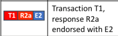

# Fabric交易流程源码分析

> 姓名：柳湛宇
>
> 学号：3180102908
>
> 专业：软件工程

本文分析的hyperledger-fabric版本为2.x，与ppt中阐释的0.6版本有一些区别。

首先，可以产生交易的Fabric SDK代表的客户端都是已经被CA授权的Client，故本文阐述的交易从被授权的客户端通过sdk产生交易请求开始。

## 0. 客户端通过sdk创建交易提案

由于sdk的版本和使用的代码有比较多的类型（如，Java，go，Node.js等），所以此处暂时省略对Fabric SDK生成提案的步骤进行分析。我们要知道的是，sdk虽然实现上有差别，但总体上都是做了2件事情：

1. 将提案封装称为符合grpc协议的protobuffer格式，并通过rpc对节点routine进行调用。
2. 对创建的交易提案基于用户处的私钥进行签名。

## 1. Endorser接受交易提案

客户端以proposal的格式向它连接的peer发送信息，这些信息要被peer中的endorser背书才能整合打包并最终可能被记录。Endorser是Peer节点的一种服务，我们暂且先分析Endorser的结构：

```go
type Endorser struct {
	ChannelFetcher         ChannelFetcher
	LocalMSP               msp.IdentityDeserializer
	PrivateDataDistributor PrivateDataDistributor
	Support                Support
	PvtRWSetAssembler      PvtRWSetAssembler
	Metrics                *Metrics
}
```

其中

* `ChannelFetcher`表示这个Endorser获取管道数据的句柄，管道的底层和后一字段LocalMSP（用于作为本地备选方案）类型相同，是msp包提供的`IdentityDeserializer`，而msp（Membership service provider）是fabric实现的一种通信机制，也类似一种管道机制，理论课中提到的channel是由多个节点的复杂拓扑构成的，而每个Peer通过channel接收句柄抽象这个信息传输过程。
* PrivateDataDistributor用于实现Endorser私有信息的传播，它的实现在正常情况下依赖fabric提供的gossip服务，通过节点间的信息传播实现信息互通。
* Support是一个接口，在endorser包下的support.go中提供实现。它整体上为Endorser提供一些其需要的routine，来处理客户端提交的proposal，相关的方法可在之后分析。
* PvtRWSetAssembler字段控制上述PrivateDataDistributor提供的度写句柄，并按需添加节点相关信息。
* Metrics字段是一个数据字段，主要用于维护关于Endorser的各种计时器，主要由metrics包的Counter组成。

被赋能Endorser的节点，会在接收到用户端的提案后进行处理，主要流程在方法`ProcessProposal`中，具体步骤分析见大部分行内注释（core/endorser.go）：

```go
func (e *Endorser) ProcessProposal(ctx context.Context, signedProp *pb.SignedProposal) (*pb.ProposalResponse, error) {
	// start time for computing elapsed time metric for successfully endorsed proposals
	// 开启接收计时器
	startTime := time.Now()
	e.Metrics.ProposalsReceived.Add(1)

	// 从ctx中获取请求地址
	addr := util.ExtractRemoteAddress(ctx)
	endorserLogger.Debug("request from", addr)

	// variables to capture proposal duration metric
	success := false

	// 将签提案解包
	// channel中传输的包是字节流形式传输的，这里通过fabric的Ledger定义的各项协议将包解析映射成对象
	// up就是解压后的协议包：UnpackedProposal
	up, err := UnpackProposal(signedProp)
	if err != nil { // 解包过程出现错误
		e.Metrics.ProposalValidationFailed.Add(1)
		return &pb.ProposalResponse{Response: &pb.Response{Status: 500, Message: err.Error()}}, err
	}

	var channel *Channel
	if up.ChannelID() != "" {// 指定了ChannelID
		// 将ChannelFetcher绑定在指定的ChannelID，这将通过Endorser所在的Peer节点的信道map实现
		channel = e.ChannelFetcher.Channel(up.ChannelID())
		if channel == nil {
			return &pb.ProposalResponse{Response: &pb.Response{Status: 500, Message: fmt.Sprintf("channel '%s' not found", up.ChannelHeader.ChannelId)}}, nil
		}
	} else {
		channel = &Channel{
			IdentityDeserializer: e.LocalMSP,
		}
	}

	// 检查提案信息，这里的检查指的是对头结点的检查
	err = e.preProcess(up, channel)
	if err != nil {
		return &pb.ProposalResponse{Response: &pb.Response{Status: 500, Message: err.Error()}}, err
	}

	defer func() {
		meterLabels := []string{
			"channel", up.ChannelHeader.ChannelId,
			"chaincode", up.ChaincodeName,
			"success", strconv.FormatBool(success),
		}
		// 根据metric定时器信息和提案信息更新Endorser的定时
		e.Metrics.ProposalDuration.With(meterLabels...).Observe(time.Since(startTime).Seconds())
	}()
	// 解析提案的主体，经过处理后，返回的pResp是对客户端的提案回应
	pResp, err := e.ProcessProposalSuccessfullyOrError(up)
	if err != nil {
		return &pb.ProposalResponse{Response: &pb.Response{Status: 500, Message: err.Error()}}, nil
	}

	// 这个if代表Endorser成功为用户提案背书
	if pResp.Endorsement != nil || up.ChannelHeader.ChannelId == "" {
		// We mark the tx as successful only if it was successfully endorsed, or
		// if it was a system chaincode on a channel-less channel and therefore
		// cannot be endorsed.
		success = true

		// total failed proposals = ProposalsReceived-SuccessfulProposals
		e.Metrics.SuccessfulProposals.Add(1)
	}
	return pResp, nil
}

```

可以看到，作为Endorser的节点在接收到用户提案后，通过解压，验证等一系列处理后，对发送的提案进行处理，其中Endorser中的Metrics对当前状态维护一系列及时器，用于处理和验证。

另外我们要注意到，每个fabric的peer节点在成为Endorser之前，都肯定是Committer，它们都可以接收客户端的提案。但是，某个客户端对应的Endorser却与其使用的智能合约有关，显然并不是固定的，所以Committer接收提案实际上是面向grpc的，而Endorser则面向抽象的Channel。

Committer是core目录下定义的一组的接口和实现，其在自身抽象层面处理数据提供的简要routine如下：

* 使用`CommitWithPvtData`将区块和私有数据写入账本
* 使用`GetPvtDataAndBlockByNum`通过私有数据提供区块检索功能
* 使用`GetPvtDataByNum`从给定块号的区块中返回私有数据切片
* 其他服务

关于Committer的详细内容，会在之后描述Committer获取并传递区块的部分阐述。

## 2. Endorser模拟交易并产生背书签名

上述操作中其中处理提案的主体代码是`ProcessProposalSuccessfullyOrError`它处理并生成针对用户的提案相应，其主要流程为：

* 基于解压后的提案构建`TransactionParams`并根据需要构建`TxSimulator`绑定之：

```go
	txParams := &ccprovider.TransactionParams{
		ChannelID:  up.ChannelHeader.ChannelId,
		TxID:       up.ChannelHeader.TxId,
		SignedProp: up.SignedProposal,
		Proposal:   up.Proposal,
	}

	logger := decorateLogger(endorserLogger, txParams)

	if acquireTxSimulator(up.ChannelHeader.ChannelId, up.ChaincodeName) {
		txSim, err := e.Support.GetTxSimulator(up.ChannelID(), up.TxID())
		if err != nil {
			return nil, err
		}
		// 共享锁相关的操作
		defer txSim.Done()

		hqe, err := e.Support.GetHistoryQueryExecutor(up.ChannelID())
		if err != nil {
			return nil, err
		}

		txParams.TXSimulator = txSim
		txParams.HistoryQueryExecutor = hqe
	}
```


* 基于其绑定的Support，以及其自身的routine，通过提案信息索取到链上代码（chaincode），进行一系列的处理，生成基于链上代码的背书信息`cdLedger`。

```go
cdLedger, err := e.Support.ChaincodeEndorsementInfo(up.ChannelID(), up.ChaincodeName, txParams.TXSimulator)
```

* **通过已生成的信息，用`SimulateProposal`调用链上代码，并接取得到的相应结果和背书结果**

```go
res, simulationResult, ccevent, err := e.SimulateProposal(txParams, up.ChaincodeName, up.Input)
```

这一步是关键一步，跟进`SimulateProposal`方法后发现，它将尝试执行指定的交易，并通过调用链上代码到交易引用和作为Endorser的peer节点来完成本地持有的状态拷贝。

* 对得到的结果进行一系列检验，并分别组装成提单的返回响应与prp（Proposal Response Payload）

```go
prpBytes, err := protoutil.GetBytesProposalResponsePayload(up.ProposalHash, res, simulationResult, cceventBytes, &pb.ChaincodeID{
   Name:    up.ChaincodeName,
   Version: cdLedger.Version,
})
```

* **通过上述获取的账本cdLedger获得背书插件，并根据prp等信息对提案进行背书**

```
endorsement, mPrpBytes, err := e.Support.EndorseWithPlugin(escc, up.ChannelID(), prpBytes, up.SignedProposal)
```

* 返回相应结果

处理流程调用Ledger上的背书插件（**这也是1.x以后fabric的特色，即组件插件化**）对提案进行背书，处理完成后返回相应的回复值。

## 3 组合客户的已被背书交易

这个部分的主要流程是，客户端在收到了上述Endorser的背书后，获悉了自己的提案是否获得了允许。这个过程中，客户通过P2P网络传输数据，而把数据打包成区块的是Orderer这一关键节点。

所以，我们需要着重分析的是从P2P网络中读取Transaction，将其组合为区块的Orderer节点。

### 3.1 Orderer节点的基本分析

首先分析一下Orderer的数据结构（integration/nwo/fabricconfig/orderer.go）：

```go
type Orderer struct {
   General              *General              `yaml:"General,omitempty"`
   FileLedger           *FileLedger           `yaml:"FileLedger,omitempty"`
   Kafka                *Kafka                `yaml:"Kafka,omitempty"`
   Operations           *OrdererOperations    `yaml:"Operations,omitempty"`
   ChannelParticipation *ChannelParticipation `yaml:"ChannelParticipation,omitempty"`
   Consensus            map[string]string     `yaml:"Consensus,omitempty"`
   ExtraProperties map[string]interface{} `yaml:",inline,omitempty"`
}
```

我们分析其中的一些字段，General字段代表一些Orderer的作为服务端的基本信息；Legder指示Orderer节点的账本；Consensus和ExtraProperties字段实际上体现了Fabric从1.x版本以来的特性：基于共识的模块化架构；而Kafka字段则非常关键，这体现了Orderer是选用Kafka这个分布式中间件作为处理多个Peer广播来Transaction时，区块打包的规则。

此处kafka的实现机制较为复杂，按下不表，我们只需要知道，Fabric中的Orderer通过使用kafka，能够在多个节点同时向作为服务端的Orderer发送消息时形成串行队列，然后供其封装成若干个区块并写入Ledger中，并最终形成区块链。

### 3.2 P2P网络到Orderer节点的数据传输

peer节点群向Orderer发送信息的方法是应该是广播（事实上，在去中心化架构的体系中，所有信息的传播方法都是一种广义的广播），我们能从peer/node/start.go中发现`initGossipService`方法，这说明了peer节点的广播通信是基于gossip服务的，这是fabric实现的一种信息迭代服务，比较复杂，此处按下不表，我们只需要知道，多个Peer节点能通过Gossip等服务，将要更新的事务发送到Orderer节点，我们把关注重点放在Orderer对数据的处理上。

### 3.3 Orderer将事务打包成为区块

在这个模型中，显然传输的peer是客户端，Orderer是服务端。而此处的服务端有一个抽象模型：

```go
type server struct {
   bh    *broadcast.Handler
   dh    *deliver.Handler
   debug *localconfig.Debug
   *multichannel.Registrar
}
```

我们可以看到，重要的字段就是用于接收消息的bh和用于传送消息的dh。它们分别是不同服务下的Handler接口，稍后会深入分析其在两个语境下的实现。

首先，作为server运行的Orderer在orderer/common/server/server.go中定义的`Broadcast`方法中接到某个peer传递信息的stream，它会交由bh.Handle处理：

```go
return s.bh.Handle(&broadcastMsgTracer{
   AtomicBroadcast_BroadcastServer: srv,
   msgTracer: msgTracer{
      debug:    s.debug,
      function: "Broadcast",
   },
})// 这里返回的仅仅是错误信息，Orderer更新信息通过Broadcast而非返回值
```

我们跟进找到Handle函数的实现（orderer/common/broadcast/broadcast.go），可以看到函数读取

可以看到除去错误处理，主体部分如下：

```go
msg, err := srv.Recv()
resp := bh.ProcessMessage(msg, addr)
err = srv.Send(resp)
```

而其中msg的类型是Envelope，对应的就是课上所讲的Peer端传送的数据结构：

```go
type Envelope struct {
	// A marshaled Payload
	Payload []byte `protobuf:"bytes,1,opt,name=payload,proto3" json:"payload,omitempty"`
	// A signature by the creator specified in the Payload header
	Signature            []byte   `protobuf:"bytes,2,opt,name=signature,proto3" json:"signature,omitempty"`
	XXX_NoUnkeyedLiteral struct{} `json:"-"`
	XXX_unrecognized     []byte   `json:"-"`
	XXX_sizecache        int32    `json:"-"`
}
```



上述处理代码中，`ProcessMessage`的功能为验证和Enqueue对应的Envelope，跟进之，可以发现，首先这个方法围绕下面这行代码进行信息的头部验证：

```go
chdr, isConfig, processor, err := bh.SupportRegistrar.BroadcastChannelSupport(msg)
```

此后，利用上述处理获得的processor句柄，对消息进行入队处理）：

```go
if err = processor.WaitReady(); err != nil {
   ...// 省略错误处理
}

err = processor.Order(msg, configSeq)
//如果isConfig为真，那么此处的处理为 err = processor.Configure(config, configSeq)
if err != nil {
   ...// 省略错误处理
}
```

`WaitReady`初步同步创建入队情况。我们跟进Order或Configure方法，最终它们都的核心步骤都是orderer/consensus/kafka/chain.go的`enqueue`方法，它的声明如下：

```go
func (chain *chainImpl) enqueue(kafkaMsg *ab.KafkaMessage) bool
```

可以看到，这时两种分支都将信息封装为kafka中间件接受的信息格式，之后将信息送入kafka中间件：

```go
message := newProducerMessage(chain.channel, payload)
if _, _, err = chain.producer.SendMessage(message); err != nil {
  // 省略错误处理
}
```

我们不再深入分析kafka中间件本身的内容，转而去查看kafka中间件的产出物，在kafka服务端启动的服务中，我们发现了：`func (chain *chainImpl) processMessagesToBlocks() ([]uint64, error)`，显然它读取kafka的产出，并将其组装成为区块，这个方法比较长，但它描述了接收端的逻辑，主要是：

* 从接收端获取信息
* 根据信息的种类对其进行处理
* 主要利用`chain.processRegular`进行处理，并对区块进行填充
* **最后调用`chain.CreateNextBlock`和`chain.WriteBlock`将区块创建并写入账本**

至此，Orderer完成了对信息的接收和处理。此时，交易已经作为区块被记入到了Orderer的账本，接下来要做的事情就是将新增区块更新到每个Peer节点的账本。

## 4. 背书交易区块的提交

所谓“提交”，在区块链这个去中心化应用下其实是将区块链更新到网络中的每个节点，所以Orderer创建好的区块，也并不是指定某个目标节点，而是需要利用一些机制将新建区块广播到每个节点。但这样的实现首先需要将区块传送给Leader节点（在老师课堂上的讲授中，提到了Leader是Peer节点选举出来的作为Gossip服务的重要中继节点），再由Leader节点进行广播，所以我们在这个部分仅重点讨论Orderer将区块信息更新到Leader的过程。

### 4.1 Leader节点获取并验证区块

Orderer完成块的创建后，使用deliverservice的分发客户端发送给gossip服务的服务器，这里我们分析这个只有Leader才会开启的deliverservice。

代码实现在core/deliverservice/deliveryclient.go，我们可以看到`DeliverService`接口开启服务的方法：

```go
StartDeliverForChannel(chainID string, ledgerInfo blocksprovider.LedgerInfo, finalizer func()) error
```

到对应的实现中去，可以发现，整体情况就是的实现原形根据提供的信息创建chainID到Deliverer的映射，而因为只有Leader节点才会启动gossip的服务器，所以这样的Orderer就能实现到Leader的传送.而每对应开启一个传送的服务，也就会开启一个与之对应的goroutine（这是go语言十分优秀的特性之一）：

```go
d.blockProviders[chainID] = dc
go func() {
   dc.DeliverBlocks()
   finalizer()
}()
```

因此我们跟进到Deliverer（位置在internal/pkg/peer/blocksprovider/blocksprovider.go）的信息，它事实上就是BlocksProvider的实现，而主要实现的方法就是上述提到的`DeliverBlocks`方法，我们分析其中的主干代码：

```go
ledgerHeight, err := d.Ledger.LedgerHeight()
seekInfoEnv, err := d.createSeekInfo(ledgerHeight)
deliverClient, endpoint, cancel, err := d.connect(seekInfoEnv)
go func() {
			for {
				resp, err := deliverClient.Recv()
				...
			}
		}()
RecvLoop：for{
	...
	err = d.processMsg(response)
}
```

可以发现，这个方法从账本中获取信息并最终连接到Orderer，不断获取区块并用`processMsg`处理，我们跟进并主要观察处理块的分支，发现对区块的验证通过以下一个判断实现：

```go
if err := d.BlockVerifier.VerifyBlock(gossipcommon.ChannelID(d.ChannelID), blockNum, t.Block); err != nil {
   return errors.WithMessage(err, "block from orderer could not be verified")
}
```

我们跟进这个VerifyBlock接口方法的具体实现，可以看到它是Gossip服务提供的一种加密验证，位于internal/peer/gossip/mcs.go，可以看到，它对区块进行一系列反序列化的处理并依据给出的信息进行验证，通过验证的区块就可以被Leader由Gossip服务分发。

### 4.2 通过Gossip服务完成区块的广播

上述进程进行到了区块完成了相关的验证，可以被分发。从上述`processMsg`方法继续，首先区块将被用`Mashal`序列化为字节序列，之后依据它构建对应的payLoad和gossipMsg：

```go
// Create payload with a block received
payload := &gossip.Payload{
   Data:   marshaledBlock,
   SeqNum: blockNum,
}

// Use payload to create gossip message
gossipMsg := &gossip.GossipMessage{
   Nonce:   0,
   Tag:     gossip.GossipMessage_CHAN_AND_ORG,
   Channel: []byte(d.ChannelID),
   Content: &gossip.GossipMessage_DataMsg{
      DataMsg: &gossip.DataMessage{
         Payload: payload,
      },
   },
}
```

payLoad被添加到本地的同步buffer，而gossip信息则被gossip服务传输：

```go
d.Gossip.Gossip(gossipMsg)
```

我们跟随Adapter找到对应的实现，可以发现对应的实现大致分为以下步骤：

* 对数据类型进行检查并对应产生签名

```go
if protoext.IsDataMsg(sMsg.GossipMessage) {
   sMsg, err = protoext.NoopSign(sMsg.GossipMessage)
} else {
   _, err = sMsg.Sign(func(msg []byte) ([]byte, error) {
      return g.mcs.Sign(msg)
   })
}
```

* 如果这条信息指定了Channel，将其绑定到blockMsgStore中，用于被pull时使用，最后将可用的被签名过后的信息封装，并添加到emmiter中

```go
g.emitter.Add(&emittedGossipMessage{
   SignedGossipMessage: sMsg,
   filter: func(_ common.PKIidType) bool {
      return true
   },
})
```

* 当emmiter获得了指定数量的信息（burstSize），就会调用emit方法传送信息

```go
if len(p.buff) >= p.burstSize {
   p.emit()
}
```

* emit调用批处理的回调函数将封装好的数据发送，通过层层调用。最终将信息传送入`gossipBatch`发送：

```go
g.gossipBatch(msgs2Gossip)
```

* 我们关注要传输的区块数据，`gossipBatch`在将message切分为区块后，调用了`gossipInChan`方法，并传入了一个过滤器

```go
g.gossipInChan(blocks, func(gc channel.GossipChannel) filter.RoutingFilter {
   return filter.CombineRoutingFilters(gc.EligibleForChannel, gc.IsMemberInChan, g.IsInMyOrg)
})
```

* 跟进后可以看到，`gossipInChan`抽去了所有信息中的Channel信息并遍历之，再次通过切分将对应Channel的切块切分出来并且对应到Channel。之后它通过传入的filter获取当前频道中可用的节点列表，并确定最终的发送列表。通过调用对应网络服务的Send方法将信息分发出去。 **通过查阅资料可以了解到，这个filter选择节点有两个特性：数量不定，随即就近选择。**

```
for _, msg := range messagesOfChannel {
   filteredPeers := g.removeSelfLoop(msg, peers2Send)
   g.comm.Send(msg.SignedGossipMessage, filteredPeers...)
}
```

其中comm模块是grpc的客户端，我们可以把它当做信息流的入口，我们在传送端的分析到此为止，最后，只需要所有目标节点都能够接收到对应的区块信息，这一次交易的全部流程就完成了。

### 4.3 Peer节点接收Gossip服务传送的信息

Peer节点也是对应地从gossip服务中收到信息，其运行的服务端程序会利用一个go监听在GossipStream上：

```go
go conn.readFromStream(errChan, msgChan)
```

跟进后可以发现，它将收到Gossip信封，其在将信封解析成message后，利用了go语言的管道机制，通过之前传入的管道，将信息挂载在接收端的处理函数上：

```go
case msgChan <- msg:
```

这里信息会被进一步处理，转化成为可被接受服务接收的message，并在最终传送到节点gossip服务的接收端协程：

```go
go g.acceptMessages(incMsgs)// 启动协程

...

func (g *Node) acceptMessages(incMsgs <-chan protoext.ReceivedMessage) {// 协程内容
	defer g.logger.Debug("Exiting")
	defer g.stopSignal.Done()
	for {
		select {
		case <-g.toDieChan:
			return
		case msg := <-incMsgs:
			g.handleMessage(msg)
		}
	}
}
```

在这里进行一系列的有验证和处理，并最终进到ReceivedMessage实体方法，对内容和签名进行判断后，将其加入到区块链的存储和blocksPuller的存储，并在添加成功时继续迭代执行gossip服务，整个主体流程就结束了。

```go
gc.Lock()
added = gc.blockMsgStore.Add(msg.GetGossipMessage())
if added {
   gc.logger.Debugf("Adding %v to the block puller", msg.GetGossipMessage())
   gc.blocksPuller.Add(msg.GetGossipMessage())
}
gc.Unlock()
```

```go
if added {
   // Forward the message
   gc.Forward(msg)
   // DeMultiplex to local subscribers
   gc.DeMultiplex(m)
}
```

## 总结

通过研究我们大体通过分析源码走了一遍交易产生的流程，可以看到fabric的架构是极度复杂的，从中我们既可以学习到区块链和去中心化的设计思想，也可以体会到大型软件的设计思想，另外，fabric的设计极大地利用了go语言的优秀特性：如灵活的接口，多返回值，轻量级携程goroutine，以及管道机制等特性。这使得整个软件像艺术品一般，阅读源码过后收获颇丰。但因为其架构十分庞大，还有很多细节和中间过程无法探究和理解，后序可以跟进深入了解。