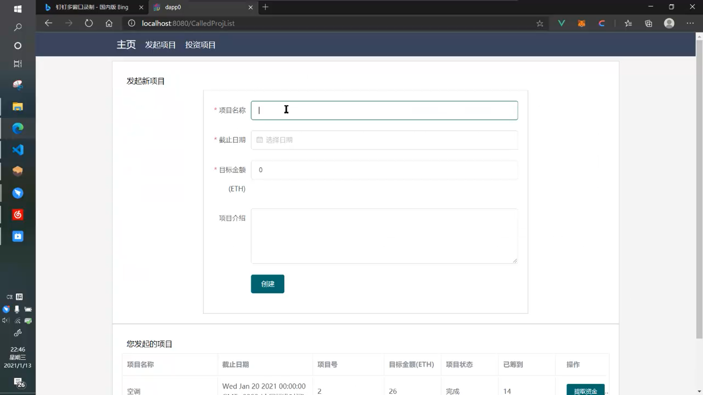
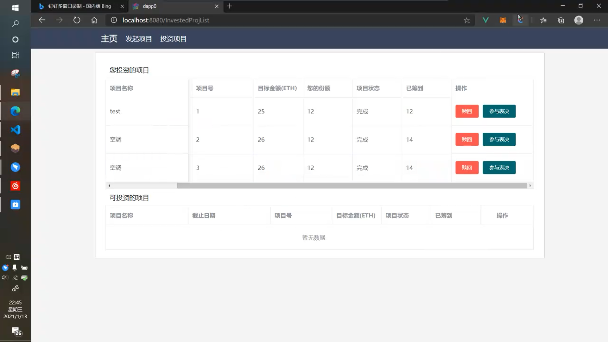

# 以太坊分布式应用开发大作业

## 如何运行

- 在本目录下输入 ```npm install``` ，安装package.json中要求的模组
  - 主要包括Vue, Element-ui, Web3
- 在本目录下输入 ```npm install -g truffle``` 安装truffle模组
- 安装Ganache并创建一个新的工作区Workplace
  - 将本目录下的truffle_config.js导入工作区
- 在本目录下输入 ```truffle migrate``` 部署智能合约到Ganache生成的区块链
  - 复制CONTRACT>Crowdfunding>Address到 /src/Global.vue 第10行
    - 即是

    ```js
    const contract = new web3.eth.Contract(arg1, arg2)
    ```

    - 的第2个参数

- 在浏览器上安装MetaMask插件
  - 将Ganache自动生成的2个账号导入MetaMask
- 在本目录下输入 ```npm run serve``` 运行前端
- 打开 http://127.0.0.1:8080 ，此时MetaMask会自动请求将账户与ip连接
  - 选择将2个导入的账户与 http://127.0.0.1:8080 连接
- 现在即可运行！

## 特性

- 发起人可以投资自己发起的众筹、可以对自己申请的资金提取进行投票，实现自持股
- 实现账户切换即时刷新页面，减少误操作
- 异步刷新回调函数采用锁机制，防止重复刷新、重复注入

## 运行截图

- 我的众筹页面
- 
- 我的投资页面
- 
