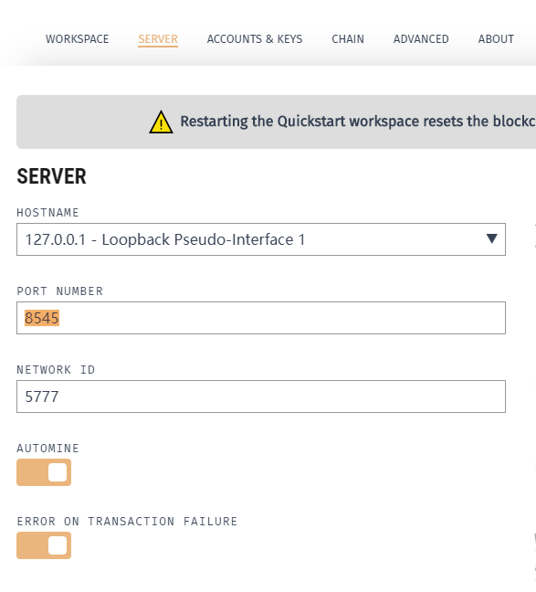
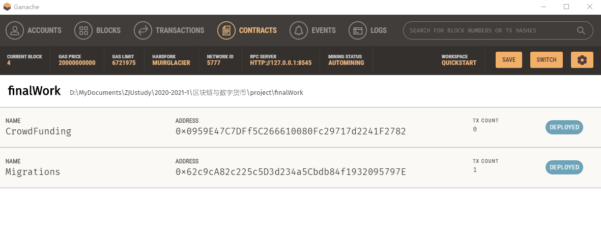
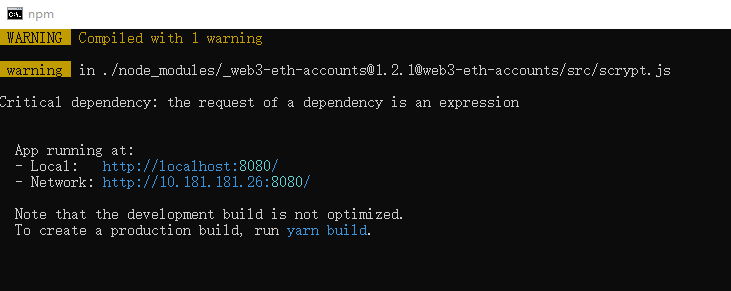
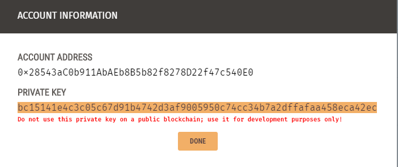
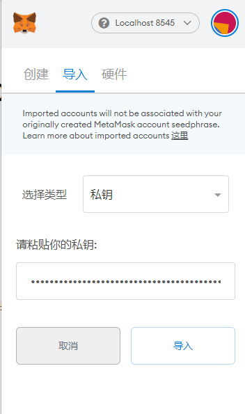
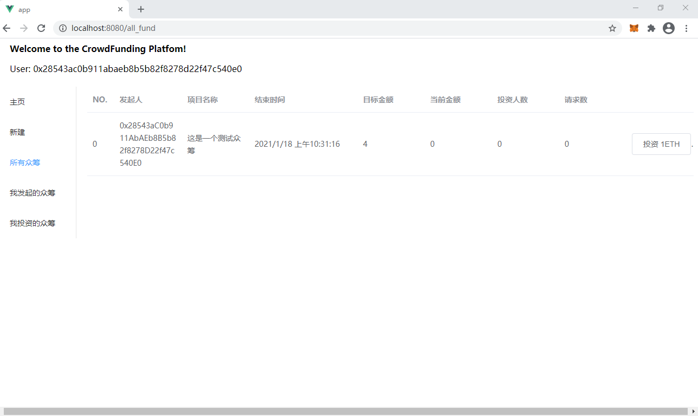
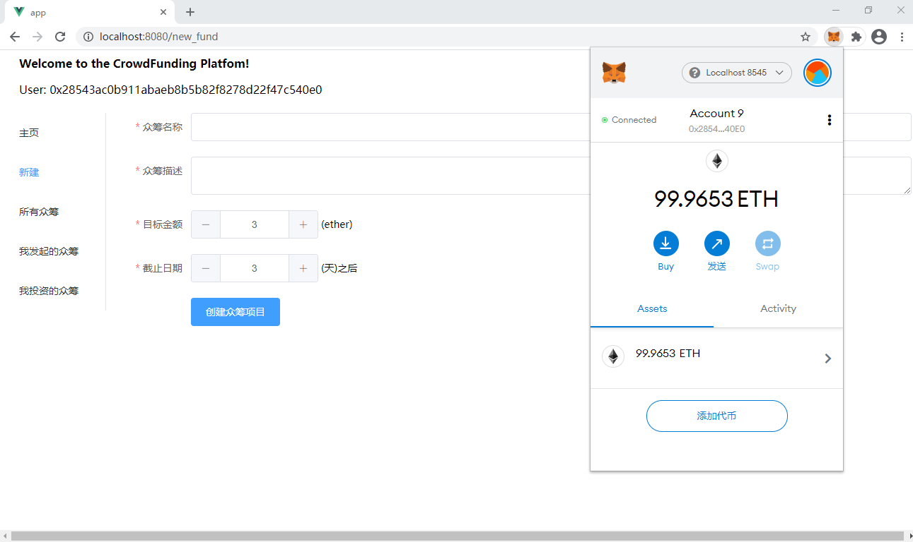
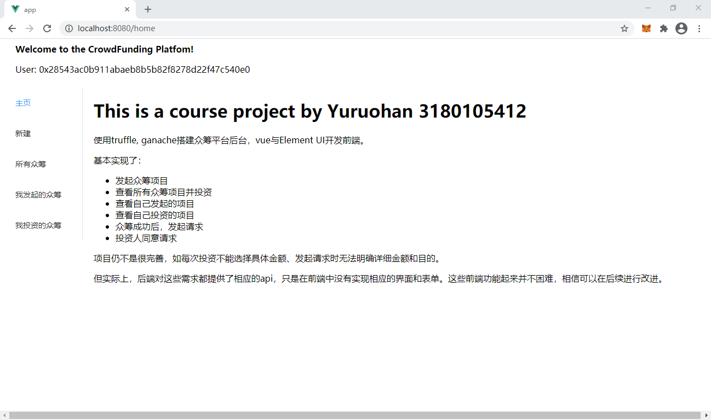
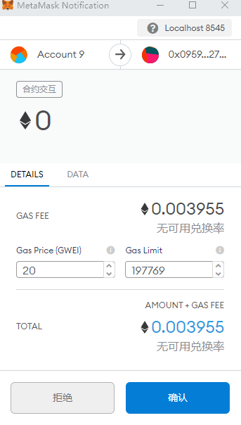

# 区块链与数字货币 Final Project

#### 运行方法：

1. 配置好`truffle`, `node.js`，`npm`，安装`ganache`，浏览器中配置`Meta Mask`插件。

2. 在`/finalWork`目录下，使用命令行运行：

   ```
   $ truffle compile
   ```

3. 打开ganache，通过QuickStart进行add project，选择`/finalWork`目录下的`truffle-cofig.js`文件，注意在server选项卡中将端口设置为8545，并点击save and restart按钮。

   

4. 在`/finalWork`目录下，使用命令行运行：

   ```
   $ truffle migrate
   ```

   提示：

   

5. 可以看到在ganache中的Contracts选项卡已经部署成功。

   

6. 进入`/finalWork/app`目录下，使用命令行运行：

   ```
   $ npm install
   $ npm run dev
   ```

   根据提示结果，通过浏览器打开网页。如：`http://localhost:8080`

   

7. 在ganache的Account选项卡中获取一个账号的私钥并复制；

   

   在浏览器的Meta Mask中通过私钥导入该账号，并与localhost:8080连接。

   

8. 观察到网页左上角提示了该用户地址信息正确，就可以开始使用了。


#### 运行成功截图







