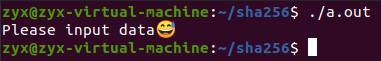
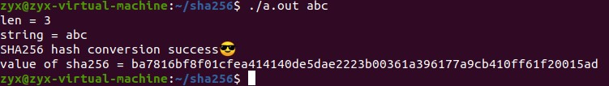
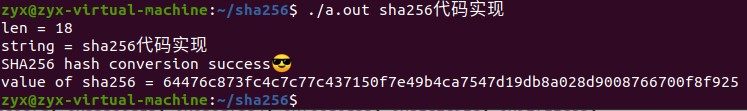
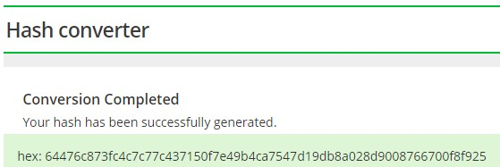
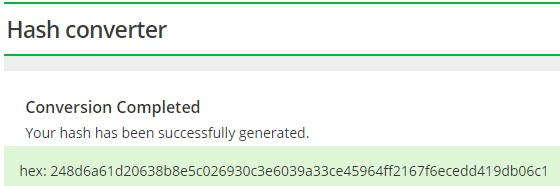

# 第一次作业

> 臧一霄 -3180103769

## **实验环境**

​    20.04.1版本Ubuntu

 

## **实验过程**

执行gcc main.c sha256.c后生成了a.out可运行文件

 

下面分别测试了四种不同输入的Hash结果 

\- 无输入 

 

 

\- 纯英文 （Eg：“abc”）

 

\- 中英文夹杂 （Eg：“sha256代码实现”）

 

 \- 长消息（Eg：“abcdbcdecdefdefgefghfghighijhijkijkljklmklmnlmnomnopnopq”）

 

 

对比[SHA256在线验证工具](https://hash.online-convert.com/sha256-generator)的转换结果，验证三次SHA256哈希转换结果都是正确的

“abc”

 

 

“sha256代码实现”

 

 

“abcdbcdecdefdefgefghfghighijhijkijkljklmklmnlmnomnopnopq”

 

 

再将sha256.h第11行的TAG修改为1

 

再次运行可以查看 【信息预处理的附加填充结果】 和 【分块迭代的最终哈希值】

