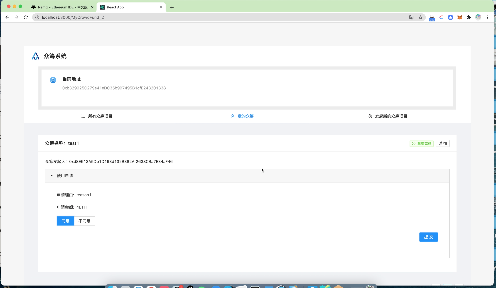
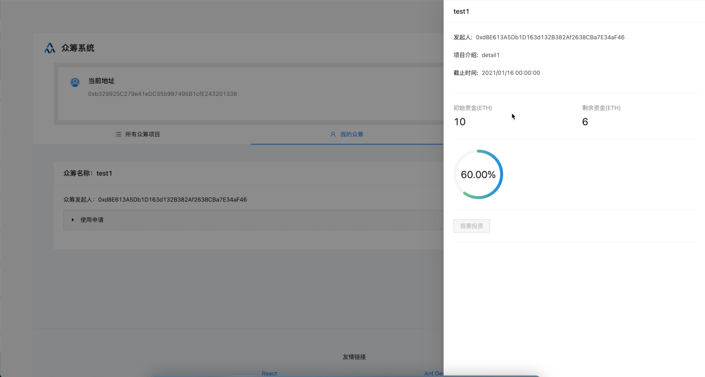

## 运行指南

- 软件要求：`ganache`、安装了 `MetaMask` 插件的 `Chrome` 浏览器、`node` 和 `npm`。
- 运行步骤
	- 打开 `ganache`，选择quickstart，点击右上角设置，在workspace中点击add project，选择 `./truffle-config.js`，在sever中设置端口为8545，点击右上角save and restart。
	- 在remix中加载 `CrowdFund.sol`，在 `MetaMask` 中添加用户，然后点击部署，将右下角的 `blockchain` 以及生成的 `CrowdFund.json` 中 `abi` 的值复制到 `./client/src/contracts/crowdfund.js` 中。
	- 进入 `./client` 目录下，运行 `npm install` 和 `npm start` 即可运行众筹项目。

## 运行截图

