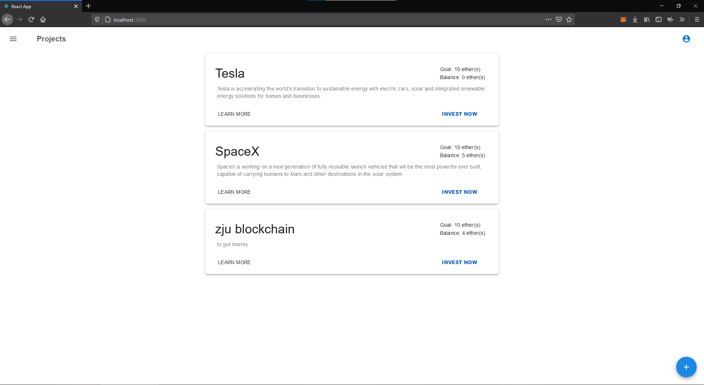
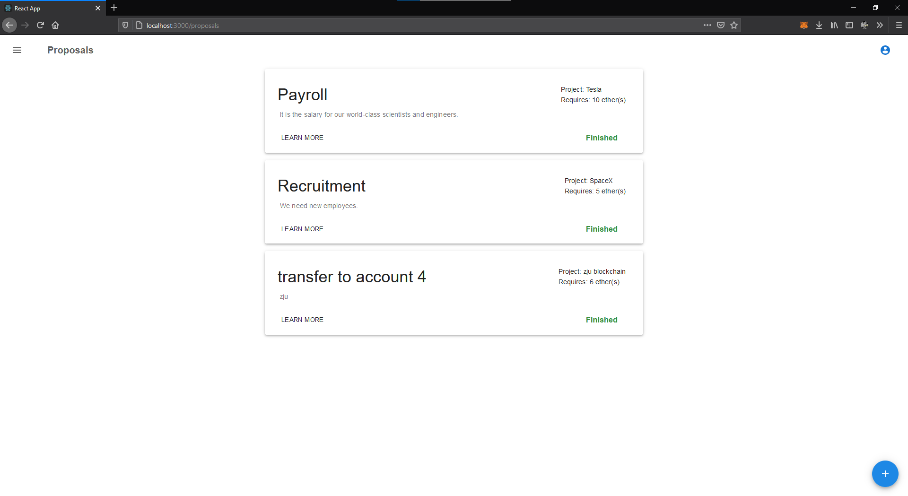
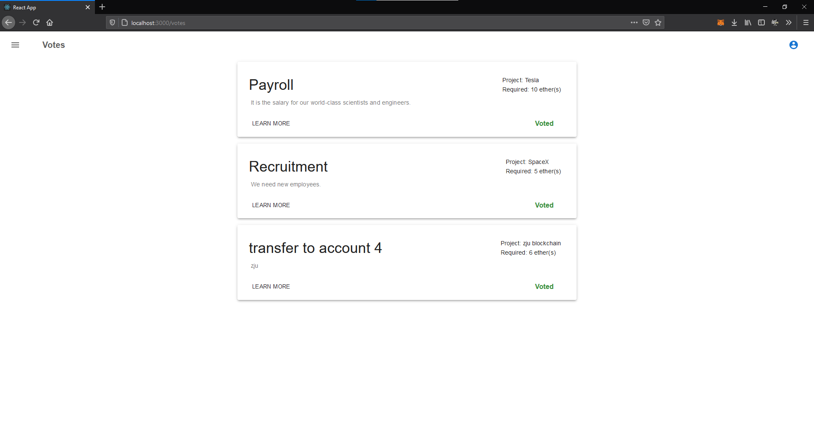
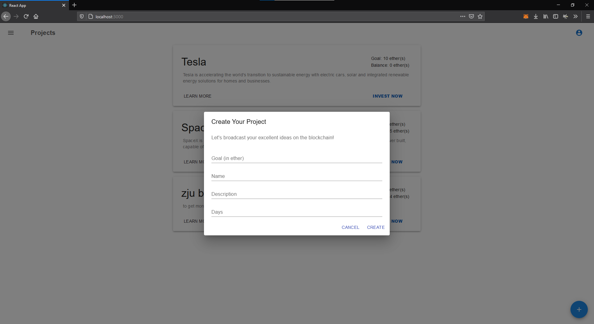
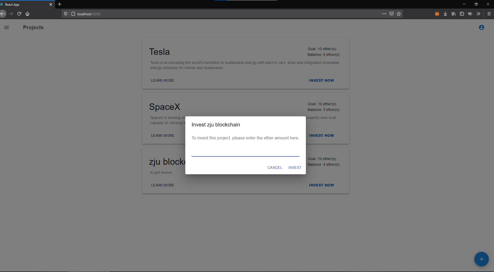
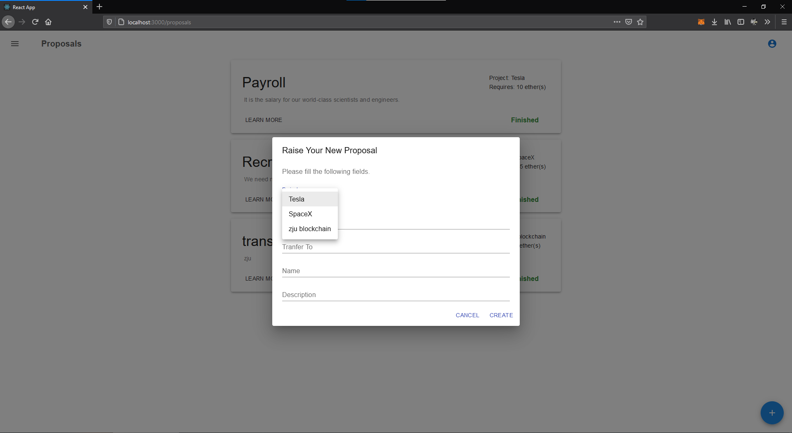

# Future Funding DApp

## 环境配置

0. 配置 truffle 等环境


1. 编译合约到本地链 Ganache 上

   ```
   cd ./Backend
   truffle compile
   truffle migrate
   ```

   

2. 修改 /future-funding-client/utils/getWeb3.js 内的合约地址: 

   ```javascript
   const CONTRACT_ADDRESS = "Your_Contract_Address"
   ```

   

3. 运行客户端

   ```
   cd ./future-funding-client
   npm install
   npm start
   ```

   


## 运行截图



<center>项目页面</center>



<center>资金使用请求</center>



<center>投票页面</center>



<center>创建项目</center>



<center>投资金额</center>



<center>资金使用请求发起</center>
