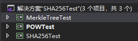
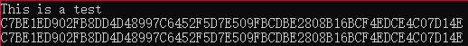
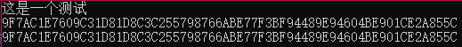
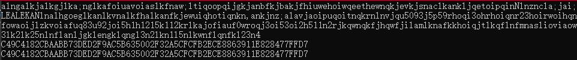
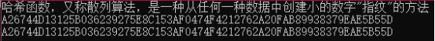
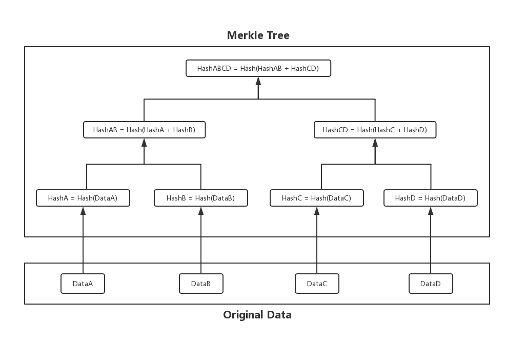
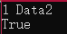
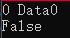
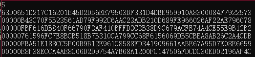

# 课程作业一

3180105160 赵天辞

### 代码运行环境：.NET Core 3.1或更高

如何运行？：

1. 安装完.NET Core SDK（3.1或更高）后打开SHA256Test文件夹，如图

1. 双击解决方案（VS2019），解决方案中有 **三个** 项目

从上至下依次对应：

**实验说明** SHA256 ****如何用于区块数据锁定**** ，

**实验说明** SHA256 ****在**** PoW ****中的作用**** ，

**SHA256** 代码实现

1. 选择对应项目编译执行，或进入对应项目目录下的bin/Debug/netcoreapp3.1执行.exe程序

一、 **SHA256**** 实现**

  1.1 SHA256类使用方法

（1） 实例化SHA256对象

var encoder = new SHA256();

（2） 设置要加密的内容

var content = &quot;哈希函数，又称散列算法，是一种从任何一种数据中创建小的数字&quot;指纹&quot;的方法&quot;

（3）  获取加密结果

var res = encoder.GetSHA256Code(content);

1.2 样例程序如何运行？

项目 **SHA256Test** 编译运行后，输入要进行哈希运算的内容（字符串），然后回车

输出结果有两行：

第一行为本人所写的SHA256算法运算结果

第二行为.NET内置加密库System.Security.Cryptography的SHA256算法加密结果

1.3 运行结果

由此可验证，本人所写的SHA256算法是基本正确的

二、 **实验说明**** SHA256 ****如何用于区块数据锁定**

2.1 实验原理

区块链利用Merkle树来确保区块数据的正确性和完整性

Merkle树原理如下图所示，其中的Hash算法即为SHA256算法

由此图不难看出，一个区块的数据改变，同时需要改变从该区块节点到Merkle树根节点的路径上的所有节点的值，由此确保了区块数据的正确性和完整。

同时，利用Merkle树的特性，我们可以快速对一个区块的数据进行校验：

例：现有区块DataB的值为&quot;Data B&quot;，我们只需要获取HashA、HashCD的值，运算得到HashABCD的值与真实值进行比较，即可校验该区块的数据

2.2 实验设计

（1）构造Merkle树

代码：

var merkleTree = new MerkleTree(valueList);

其中，valueList为各区块的数据列表（现仅支持2的幂次）

为了简化实验，样例程序设置valueList的值为{&quot;Data1&quot;, &quot;Data2&quot;, &quot;Data3&quot;, &quot;Data4&quot;}

（2） 输入区块号和区块数据，验证区块数据

代码：

varres = merkleTree.Verify(index, data)

Index为区块号，data为待校验的区块数据，返回true/false

2.3 样例程序如何运行？

项目 **MerkleTreeTest** 编译运行后，以（区块号 待校验数据）的格式输入，程序输出校验结果

默认的原始数据内容为{&quot;Data1&quot;, &quot;Data2&quot;, &quot;Data3&quot;, &quot;Data4&quot;}，区块号0-3

2.4 运行结果

区块1的数据为Data2，因此输出True

区块0的数据为Data1，因此输出False

三、 **实验说明**** SHA256 ****在**** PoW ****中的作用**

  3.1 实验原理

在区块链中，区块头的值可简单地为：

Header = SHA256(SHA256(上一个Header + 随机数nonce))

其中Header有效的标准为前n位为0，这就是POW（Proof of Work）

显然，SHA256用于计算POWHash，且n越大，计算难度更高；且如果要伪造交易，需要重新进行大量的哈希计算来找到一个有效的nonce随机数，因此修改比特币中的交易信息是计算上不可能的

  3.2 实验设计

1. 设置初始header

样例程序将初始的headerData设置为&quot;Header Data&quot;，初始的header由SHA256计算而来

2. 设置n

设置POWHash有效标准n，即前n位需要为0

3. 循环计算有效的POWHash

样例程序将默认执行5次POW运算，即依次计算5次POWHash

  3.3 如何运行样例程序？

项目 **POWTest** 编译运行后，输入POWHash有效标准n，程序会进行5次POW运算并输出POWHash（当n较大时会非常缓慢）

  3.4 运行结果

n为5以内时，程序能较快地计算出结果

当n >= 6时，程序计算较为缓慢
