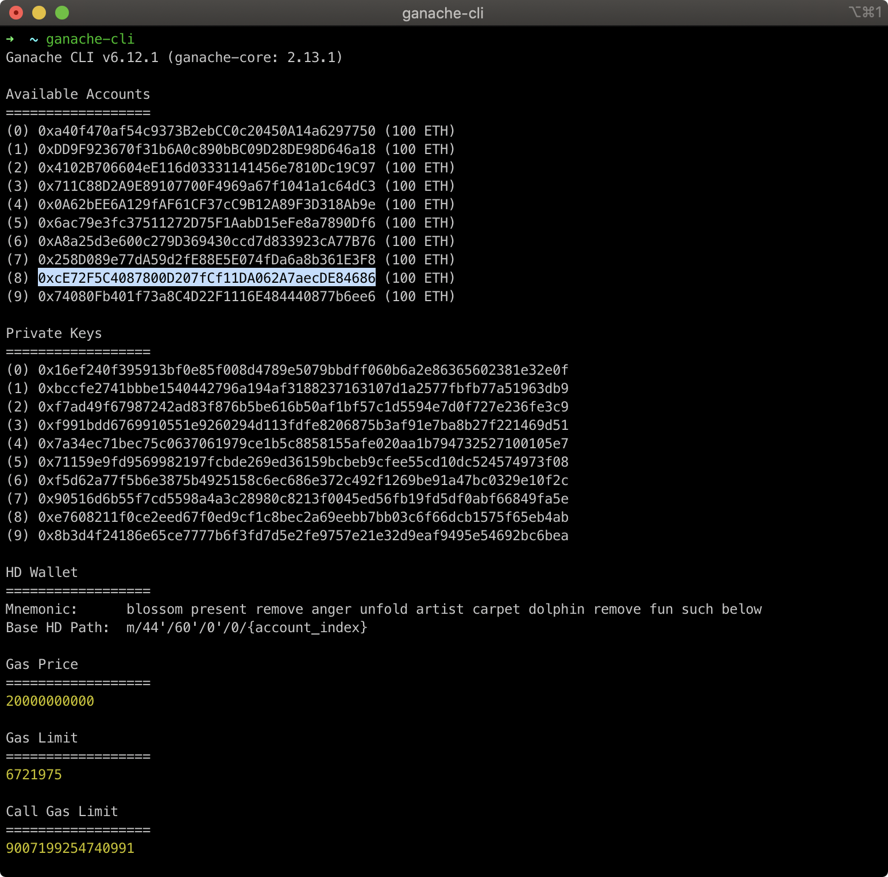
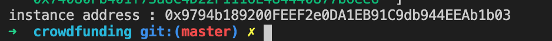
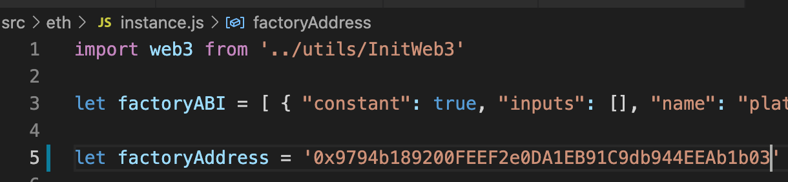
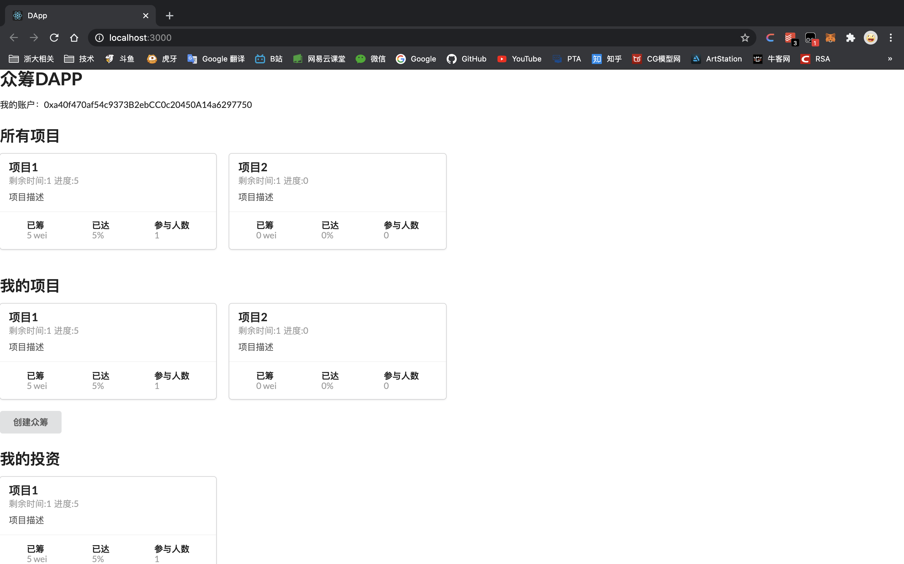

# 众筹Dapp

## 1 如何运行

1 安装ganache-cli

2 运行ganache

```bash
# 运行ganache
ganache-cli 
```



3 部署合约

在项目根目录下运行

```bash
# 部署合约
node 02-deploy.js
```

记录下最后输出的合约的instance地址



然后将合约地址拷贝到./src/eth/instance.js的第5行



4 运行项目（提前安装好metamask）

```bash
# 运行项目
npm start
```

导入账户

创建项目

捐钱

请求用钱

没达到投票率不能用

投票

然后就买好了

建立项目2

## 2 项目截图



