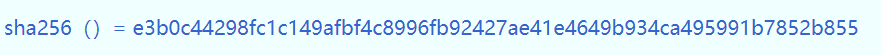
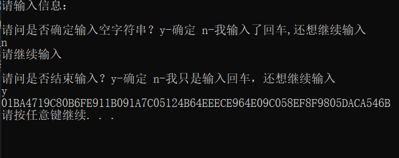
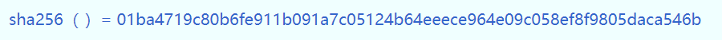
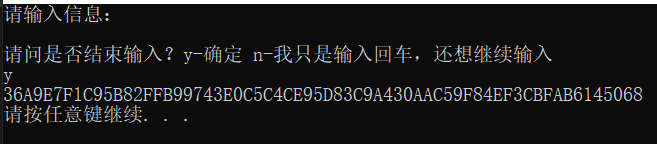
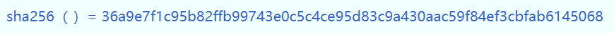
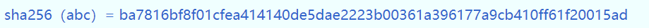
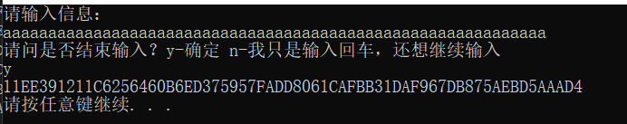
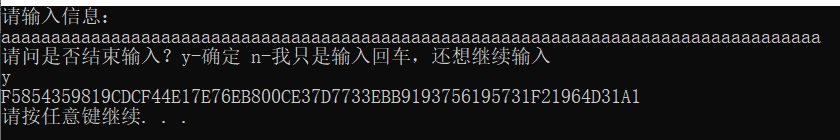
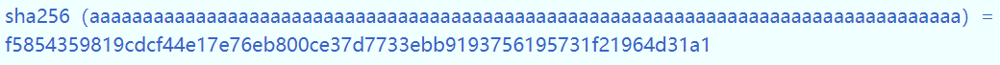
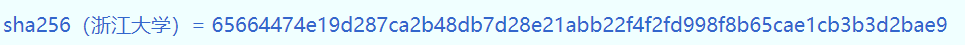

# 作业1

### 1. 如何运行代码

​	将文件“SHA256.cpp”编译运行后，按照程序提示进行输入和选择即可。

### 2. 运行结果测试

#### 	2.1 输入空字符串

​		代码结果：

​		

​		网上在线测试结果：

​		

#### 	2.2 输入一个回车

​		代码结果：

​		

​		网上在线测试结果：

​		

#### 	2.3 输入一个空格

​		代码结果：

​		

​		网上在线测试结果：

​		

#### 	2.4 输入长度小于448bits的信息

​		代码结果：

​		

​		网上在线测试结果：

​		

#### 	2.5 输入长度介于448bits至512bits之间的信息

​		代码结果：

​	

​		网上在线测试结果：

​		

#### 	2.6 输入长度超过512bits的信息

​		代码结果：

​		网上在线测试结果：

​		

#### 	2.7 输入中文（需在中文编码环境是utf-8的情况下进行测试）

​		代码结果：

​		

​		网上在线测试结果：

​		

