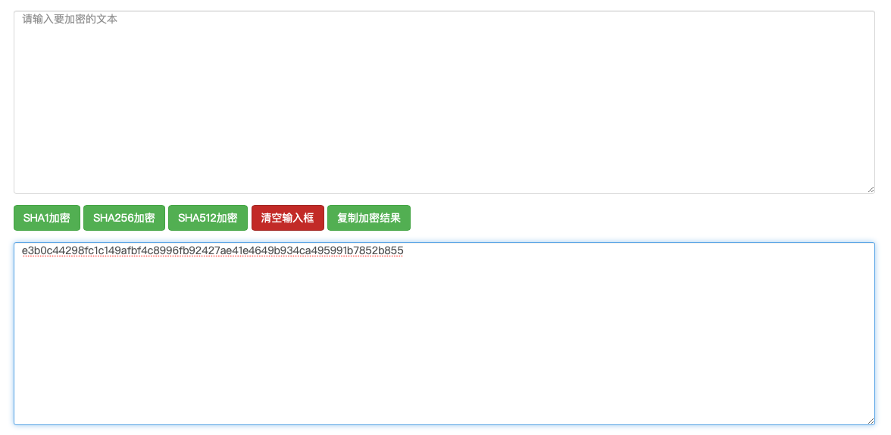
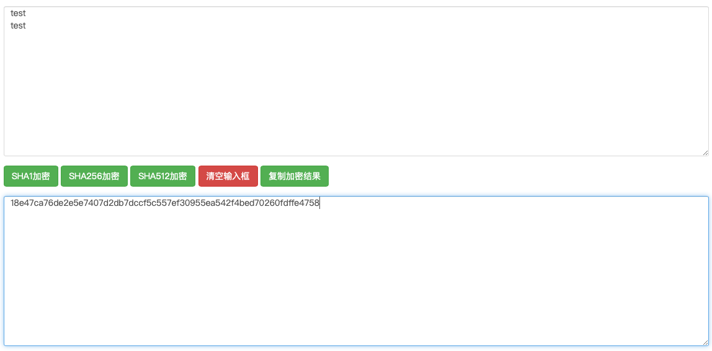
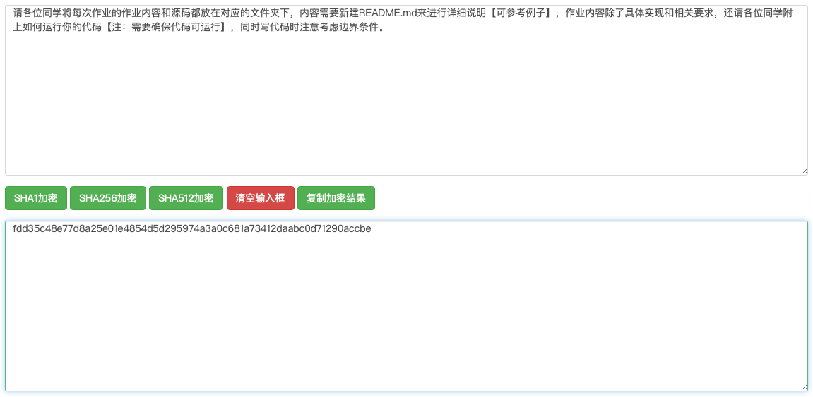

# 区块链第一次作业

姓名：黄沈一

学号：3180102081

---

## 代码运行方式

在类unix系统上，利用`g++`进行编译

```bash
g++ main.cpp -o main --std=c++11
```

运行`main`即可

```bash
./main
```

##  程序说明

由于该程序需要考虑空字符串和回车字符的问题，同时又因为命令行难以进行判断，所以整体操作会比较反人类。

该程序接收到换行字符时，会进行提问，输入`q`则进行推出，输入其他字符则会继续要求输入（此时上一次的换行符会被记录）。

具体的操作过程会在测试结果中演示。

## 测试结果

1. 空字符串

```input

```

输出结果：（注意：程序的hash输出结果为最后一行，下同）

```output
plz enter the message to encypt:

Enter q to quit, else to continue:
q
e3b0c44298fc1c149afbf4c8996fb92427ae41e4649b934ca495991b7852b855
```

参考网页结果：



2. 数据长度较小的字符串

```input
test
```

输出结果：

```output
plz enter the message to encypt:
test
Enter q to quit, else to continue:
q
9f86d081884c7d659a2feaa0c55ad015a3bf4f1b2b0b822cd15d6c15b0f00a08
```

参考结果：


3. 带有换行符的字符串

```input
test
test
```

输出结果：

```output
plz enter the message to encypt:
test
Enter q to quit, else to continue:
no
test
Enter q to quit, else to continue:
q
18e47ca76de2e5e7407d2db7dccf5c557ef30955ea542f4bed70260fdffe4758
```

参考结果：



4. 涉及中文的且超过512bit的数据

```input
请各位同学将每次作业的作业内容和源码都放在对应的文件夹下，内容需要新建README.md来进行详细说明【可参考例子】，作业内容除了具体实现和相关要求，还请各位同学附上如何运行你的代码【注：需要确保代码可运行】，同时写代码时注意考虑边界条件。
```

输出结果：

```output
plz enter the message to encypt:
请各位同学将每次作业的作业内容和源码都放在对应的文件夹下，内容需要新建README.md来进行详细说明【可参考例子】，作业内容除了具体实现和相关要求，还请各位同学附上如何运行你的代码【注：需要确保代码可运行】，同时写代码时注意考虑边界条件。
Enter q to quit, else to continue:
q
fdd35c48e77d8a25e01e4854d5d295974a3a0c681a73412daabc0d71290accbe
```

参考结果：



